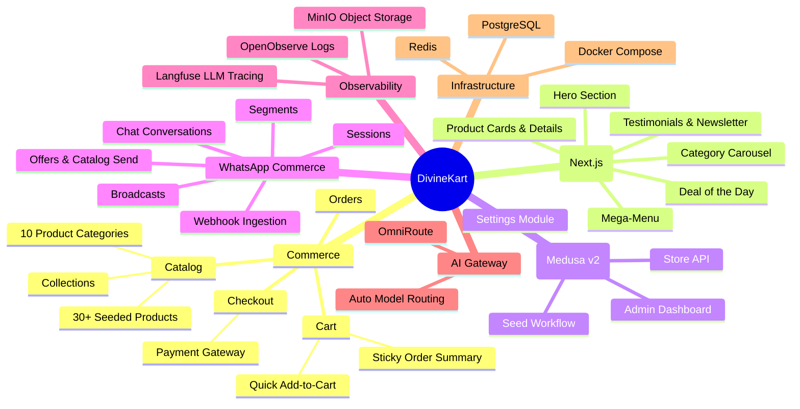
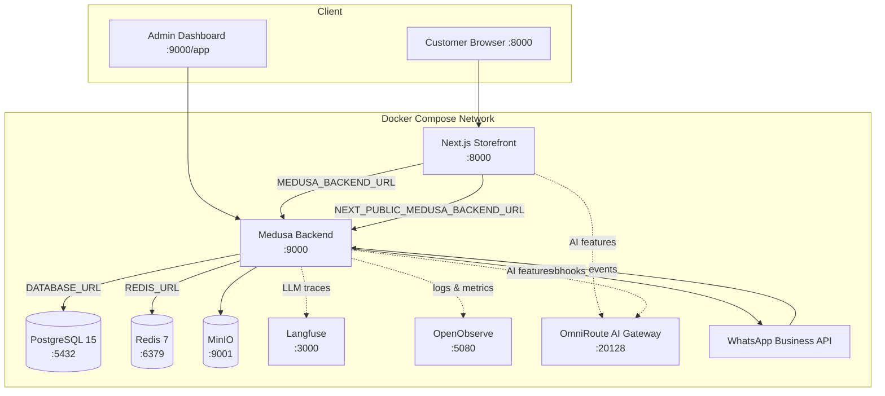
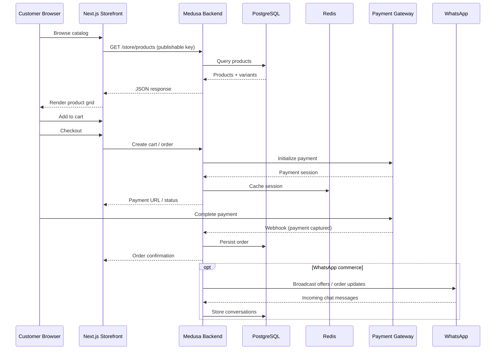

# 🕉️ DivineKart — Full-Stack Hindu Religious & Spiritual Ecommerce Platform

[](https://github.com/CodeRender7/spiritualEcom/stargazers)
[](https://github.com/CodeRender7/spiritualEcom/forks)
[](https://github.com/CodeRender7/spiritualEcom/watchers)
[](https://github.com/CodeRender7/spiritualEcom/graphs/contributors)
[](https://github.com/CodeRender7/spiritualEcom/commits/main)
[](https://github.com/CodeRender7/spiritualEcom/issues)
[](https://github.com/CodeRender7/spiritualEcom/pulls)
[](https://opensource.org/licenses/MIT)

> **DivineKart** is a production-ready, self-hosted ecommerce store for Hindu religious and spiritual products — built on **Medusa v2** backend and **Next.js** storefront, running entirely in Docker Compose. Authentic & sanctified products, Pan-India delivery, WhatsApp commerce, and a modern Indian-marketplace shopping experience.

---

## 📑 Table of Contents

- [Features at a Glance](#-features-at-a-glance)
- [Architecture Overview](#-architecture-overview)
- [Application Flow](#-application-flow)
- [Services & Components](#-services--components)
- [Product Categories](#-product-categories)
- [UI/UX Design System](#-uiux-design-system)
- [Quick Start — Docker Compose](#-quick-start--docker-compose)
- [Development — pnpm + Turbo](#-development--pnpm--turbo)
- [CI/CD Workflows](#-cicd-workflows)
- [Contributing](#-contributing)
- [Security](#-security)
- [Documentation](#-documentation)
- [Community](#-community)
- [License](#-license)

---

## ✨ Features at a Glance



---

## 🏗️ Architecture Overview



---

## 🔄 Application Flow



---

## 🧩 Services & Components

| Service | Image / Tech | Port | Role |
|---------|-------------|------|------|
| **storefront** | Next.js 14 (Node 24) | `8000` | Customer-facing SSR storefront |
| **backend** | Medusa v2 (Node 24) | `9000` | Commerce API, admin, webhooks, jobs |
| **postgres** | PostgreSQL 15 | `5432` | Primary database |
| **redis** | Redis 7 | `6379` | Cache, queues, sessions |
| **minio** | MinIO | `9001` | S3-compatible object storage (uploads) |
| **langfuse** | Langfuse v2 | `3000` | LLM observability / tracing |
| **openobserve** | OpenObserve | `5080-5081` | Logs, metrics, traces |
| **omniroute** | OmniRoute (AI gateway) | `20128` | Auto-routed AI inference for agents/features |
| **langfuse-db** | PostgreSQL 15 | internal | Langfuse backing store |

**Key integrations:**

- **WhatsApp Business Suite** — broadcasts, chat conversations, segments, sessions, offers & catalog send, webhook ingestion (`/api/webhooks/whatsapp`).
- **Admin console** — settings page + WhatsApp management under `/app` (routes: `admin/whatsapp/*`, `admin/settings/*`).
- **Razorpay** — payment gateway wired via `RAZORPAY_KEY_ID` / `RAZORPAY_KEY_SECRET`.

---

## 📦 10 Product Categories Supported

1. **Religious Photos** (Framed photos, gold foil prints, deity wall art)
2. **God Image Keyrings** (Acrylic & metal deity keychains)
3. **Spiritual Idols** (Handcrafted brass, marble, resin murtis)
4. **Spiritual Stickers** (3D holographic car & laptop stickers)
5. **Banners & Posters** (Temple banners, jagran backdrops)
6. **Photo Frames** (Wooden/gold-foiled deity frames)
7. **Handbills & Invites** (Puja pamphlets & invitation cards)
8. **Spiritual Stationery** (Gita journals, mantra bookmarks, calendars)
9. **Spiritual Flags (Dhwaja)** (Saffron Hanumanji flags, mandir flags)
10. **Spiritual Clothing** (Pitambari silk stoles, pujari kurtas, dhotis)

---

## 🎨 UI/UX Design System

Designed with a fusion of modern AI platform aesthetics (**xalen.io**) and high-converting Indian ecommerce marketplaces (**Flipkart** & **Amazon India**):

1. **xalen.io Design Adoption**:
   - **Hero Section**: Badge (`✨ 100% Authentic`) → Serif Headline (`Sacred Art & Spiritual Essentials for Every Devotee`) → Sub-headline → Dual CTAs → Stats Row (1,000+ Items, 10+ Verticals, Pan-India Delivery, 4.9★ Rating).
   - **Section Headers**: Sub-label + Serif Heading + Description.
   - **Why Choose Us**: 4 numbered feature cards (`01 Authentic & Sanctified`, `02 Pan-India Express Shipping`, etc.).
   - **Testimonials & Newsletter**: Verified customer cards & dark glassmorphism CTA strip.

2. **Flipkart & Amazon India UI Patterns**:
   - **Category Carousel**: Circular category icons horizontal scroll row.
   - **Mega-Menu**: Top navbar dropdown with multi-column category grid.
   - **Deal of the Day**: Countdown timer strip with discounted products.
   - **Product Cards**: Image hover zoom, discount badges (% OFF), MRP strikethrough, star ratings (★★★★☆), and quick Add-to-Cart.
   - **Product Listings & Details**: Breadcrumbs, gallery thumbnail switcher, related items carousel, and sticky order summary cart.

---

## 🚀 Quick Start — Docker Compose

### Prerequisites

- [Docker Desktop](https://www.docker.com/products/docker-desktop/) (Windows/Mac/Linux) installed and running.

### 1. Build and Start All Services

From the root project directory:

```bash
docker compose up --build -d
```

### 2. Service Access Endpoints

- **Storefront**: [http://localhost:8000](http://localhost:8000)
- **Medusa Admin Dashboard**: [http://localhost:9000/app](http://localhost:9000/app)
- **Medusa Store API**: [http://localhost:9000/store](http://localhost:9000/store)
- **Backend Health Check**: [http://localhost:9000/health](http://localhost:9000/health)

### 3. Default Admin Credentials

- **Email**: `admin@divinekart.com`
- **Password**: `supersecret`

### 4. Environment Variables

Copy values from `.env` (already present at the repo root):

| Variable | Purpose |
|----------|---------|
| `DATABASE_URL` | Postgres connection (internal `postgres` host) |
| `REDIS_URL` | Redis connection (internal `redis` host) |
| `JWT_SECRET` / `COOKIE_SECRET` | Backend auth secrets |
| `STORE_CORS` / `ADMIN_CORS` / `AUTH_CORS` | CORS allow-list |
| `MEDUSA_ADMIN_EMAIL` / `MEDUSA_ADMIN_PASSWORD` | Auto-created admin user |
| `NEXT_PUBLIC_MEDUSA_BACKEND_URL` | Browser-side Medusa URL (`http://localhost:9000`) |
| `MEDUSA_BACKEND_URL` | Server-side Medusa URL inside the storefront container (`http://backend:9000`) |
| `NEXT_PUBLIC_MEDUSA_PUBLISHABLE_KEY` | Publishable API key used for `/store/*` requests |
| `RAZORPAY_KEY_ID` / `RAZORPAY_KEY_SECRET` | Payment gateway credentials |
| `LANGFUSE_*` | LLM observability (public/secret keys, database) |
| `ZO_*` | OpenObserve credentials |
| `MINIO_ROOT_USER` / `MINIO_ROOT_PASSWORD` | Object storage credentials |
| `OMNIROUTE_API_KEY` | AI gateway authentication |

> **Note:** The seed script (`backend/scripts/seed-data.ts`) is idempotent. On first boot it creates the store, India/INR region, 10 collections, 30 published products, the default sales channel, and a publishable API key linked to it. If the key already exists, it is reused — so the value in `.env` must match the one seeded (re-run `docker compose exec backend medusa exec ./scripts/seed-data.ts` and read the generated key from the logs if you need to rotate it).

---

## 🛠️ Development — pnpm + Turbo

This is a pnpm + Turbo monorepo with two workspaces: `backend` (Medusa) and `storefront` (Next.js).

```bash
# Install all workspace deps (hoisted node_modules is a Medusa requirement)
pnpm install

# Run in dev mode
pnpm turbo dev

# Typecheck both packages
pnpm turbo typecheck

# Build both packages
pnpm turbo build

# Seed the database (idempotent)
pnpm seed

# Run migrations
pnpm db:migrate

# End-to-end tests (Playwright)
pnpm test:e2e
```

### Domain rules

- Never seed products via the product module's `createProducts` — always use `createProductsWorkflow`.
- Storefront server fetches use `MEDUSA_BACKEND_URL`; browser fetches use `NEXT_PUBLIC_MEDUSA_BACKEND_URL`.
- Keep the Mock fallback in `storefront/src/lib/medusa.ts` — it is load-bearing for first-boot rendering.

---

## 🔀 CI/CD Workflows

Every workflow is GitHub Actions, adapted to this pnpm + Turbo monorepo (Node 24, branch `main`).

| Workflow | Trigger | What it does |
|----------|---------|--------------|
| `ci.yml` | push/PR to `main` | `pnpm install` → `pnpm turbo typecheck` → `pnpm turbo build` |
| `check-pr-title.yml` | PR opened/edited/sync | Enforces semantic PR titles (feat/fix/docs/ci/...) |
| `codeql-analysis.yml` | push/PR + weekly | GitHub CodeQL security scan (JS/TS) |
| `labeler.yml` | PR opened/sync | Auto-labels PRs by changed paths (backend/storefront/docs/infra) |
| `greetings.yml` | first issue/PR | Welcome message for first-time contributors |
| `stale.yml` | daily cron | Marks/closes stale issues & PRs (60+7 days) |
| `feature-pr.yml` | push to non-`main` branch | Auto-opens a draft PR → `main` |
| `docker-publish.yml` | push to `main` / `v*` tags | Builds + pushes backend & storefront images to **GHCR** (multi-arch) |
| `docker-nightly.yml` | nightly cron / manual | Nightly GHCR builds of both images |
| `project-card-moved.yml` | Projects v2 item change | Labels issues/PRs by project status |
| `dependabot.yml` | weekly | Auto-PRs for npm + GitHub Actions dependency updates |

---

## 🤝 Contributing

Contributions are welcome! See [CONTRIBUTING.md](CONTRIBUTING.md) for the full guide — setup, PR flow, and quality checklist.

Quick pointers:

- **PR titles** must follow the semantic format (`feat:`, `fix:`, `docs:`, `ci:`, ...) — enforced by CI.
- **Run locally**: `pnpm install` → `pnpm turbo dev`, or `docker compose up --build -d`.
- **Verify**: `pnpm turbo typecheck` and `pnpm turbo build` must pass.
- **Issue templates**: bug reports, feature requests, docs changes, and other questions are all templated.

---

## 🛡️ Security

Security is treated as a first-class concern. See the [Security Setup & Hardening Guide](docs/setup/security/README.md) for:

- Baseline setup: authentication, secrets management, CORS, rate limiting.
- Hardening: TLS, firewall, fail2ban, container hardening, OWASP basics.

> **Reporting a vulnerability:** please use GitHub's [Security Advisories](https://github.com/CodeRender7/spiritualEcom/security/advisories/new) — do **not** open a public issue.

---

## 📚 Documentation

The `docs/` folder contains the complete setup-plan and operations documentation:

| Area | Location |
|------|----------|
| Setup index & conventions | [`docs/setup/README.md`](docs/setup/README.md) |
| VPS & infra (AWS/GCP/Azure/DO/Hetzner/Vultr + PaaS + self-hosted) | [`docs/setup/vps/`](docs/setup/vps/README.md) |
| Payment gateways (Razorpay/Stripe/PayPal/PayU) | [`docs/setup/payments/`](docs/setup/payments/README.md) |
| Storefront & admin | [`docs/setup/storefront-admin/`](docs/setup/storefront-admin/README.md) |
| Security setup & hardening | [`docs/setup/security/`](docs/setup/security/README.md) |
| Integrations (WhatsApp, Langfuse, OpenObserve, MinIO, OmniRoute) | [`docs/setup/integrations/`](docs/setup/integrations/README.md) |
| Architecture decisions (ADR) | [`docs/adr/`](docs/adr/) |
| Agent & domain docs | [`docs/agents/`](docs/agents/) |

---

## 👥 Community

- **Discussions**: [GitHub Discussions](https://github.com/CodeRender7/spiritualEcom/discussions) — questions, ideas, feedback.
- **Issues**: [GitHub Issues](https://github.com/CodeRender7/spiritualEcom/issues) — bugs and feature requests (templates enforced).
- **Pull Requests**: [Open a PR](https://github.com/CodeRender7/spiritualEcom/pulls) — auto-draft PRs for `feature-*` branches.

---

## 📝 License

Distributed under the **MIT License**. See the MIT badge at the top of this file for reference. (A `LICENSE` file will be added once the copyright holder name is confirmed.)

---

## 📈 Project Activity

<!-- TODO: Replace with the real Repobeats embed URL after the repo is pushed —
     get it from https://repobeats.axiom.co/ (one-time registration). -->


---

<div align="center">

**Made with ❤️ for the spiritual community — [Star this repo](https://github.com/CodeRender7/spiritualEcom) ⭐**

</div>