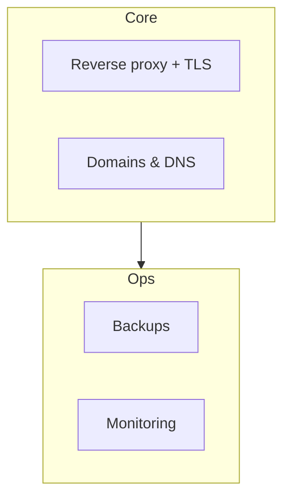

# Infrastructure Guides

Shared infrastructure topics that apply to every DivineKart deployment, regardless of provider.

## Level 1 — Infra overview

## Guides

| Topic | Guide | Applies when |
|-------|-------|--------------|
| Reverse proxy + TLS | [reverse-proxy-tls.md](reverse-proxy-tls.md) | Any VPS / self-hosted deploy |
| Domains & DNS | [domains-dns.md](domains-dns.md) | Every production deploy |
| Backups | [backups.md](backups.md) | Any deploy storing data |
| Monitoring | [monitoring.md](monitoring.md) | Any deploy with OpenObserve |

## Recommended order

1. [Domains & DNS](domains-dns.md) — get `your-domain.com` pointing at the server
2. [Reverse proxy & TLS](reverse-proxy-tls.md) — HTTPS for everything
3. [Backups](backups.md) — protect Postgres/MinIO from day one
4. [Monitoring](monitoring.md) — see errors before customers do