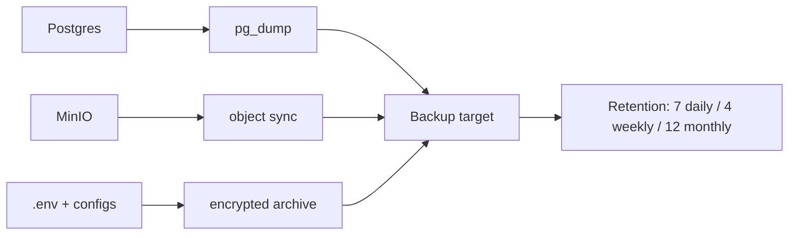

# Backups

Back up the DivineKart data layer — Postgres, MinIO objects, and `.env` secrets — on a schedule.

## Level 2 — Backup flow



## What to back up

| Data | Tool | Frequency |
|------|------|-----------|
| Postgres DB | `pg_dump` / `pg_dumpall` | daily |
| MinIO uploads | `mc mirror` (MinIO client) | daily |
| `.env`, compose files, Dockerfiles | encrypted archive | on change |
| Redis | optional (cache only — rebuildable) | skip |

## One-shot Postgres backup

```bash
docker compose exec -T postgres pg_dump -U divinekart divinekart \
  | gzip > divinekart-$(date +%F).sql.gz
```

## Automated nightly backup (host cron)

`/etc/cron.d/divinekart-backup`:

```
0 2 * * * root /opt/divinekart/backup.sh >> /var/log/divinekart-backup.log 2>&1
```

`/opt/divinekart/backup.sh`:

```bash
#!/bin/bash
set -euo pipefail
cd /opt/divinekart
mkdir -p backups/daily

docker compose exec -T postgres pg_dump -U divinekart divinekart \
  | gzip > "backups/daily/divinekart-$(date +%F).sql.gz"

# MinIO (if you have the client)
docker compose exec -T minio mc alias set local http://minio:9000 "$MINIO_ROOT_USER" "$MINIO_ROOT_PASSWORD"
docker compose exec -T minio mc mirror --overwrite --remove local/uploads backups/daily/minio-uploads

# Keep 7 daily, 4 weekly, 12 monthly
find backups/daily -name '*.sql.gz' -mtime +7 -delete
```

Make it executable: `chmod +x /opt/divinekart/backup.sh`.

## Off-site destination

Never keep backups only on the server. Options:

- **S3-compatible**: `rclone` sync to AWS S3 / Backblaze B2 / Cloudflare R2
- **rsync** to a second VPS or home NAS
- **Hosted**: provider snapshots (DO droplet backups, Hetzner snapshots, AWS AMI/EB snapshots)

```bash
rclone sync /opt/divinekart/backups remote:divinekart-backups --checkers=16
```

## Restore drill

```bash
# Restore Postgres from a dump
docker compose exec -T postgres gunzip -c backups/daily/divinekart-2026-08-15.sql.gz \
  | docker compose exec -T postgres psql -U divinekart divinekart
```

Test the restore at least quarterly — a backup you've never restored is a guess.

## Verification checklist

- [ ] Nightly cron ran: check `/var/log/divinekart-backup.log`
- [ ] Dump non-empty: `gzip -t backups/daily/*.sql.gz`
- [ ] Off-site sync completed
- [ ] Restore drill passed this quarter