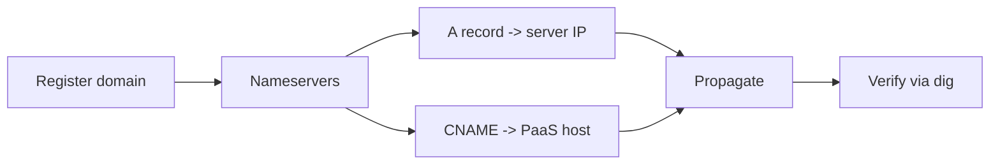

# Domains & DNS

Map domains to the DivineKart deployment and manage DNS records.

## Level 2 — DNS flow



## Hostname plan

| Host | Points to | Purpose |
|------|-----------|---------|
| `your-domain.com` | server IP (A) / PaaS host (CNAME) | Storefront |
| `your-domain.com/app` | backend `:9000` (via proxy) | Admin console |
| `obs.your-domain.com` | server IP | OpenObserve |
| `lf.your-domain.com` | server IP | Langfuse |
| `minio.your-domain.com` | server IP | MinIO console |

## Record types

| Type | Use when | Example |
|------|----------|---------|
| **A** | VPS with a fixed IP | `@  A  192.0.2.10` |
| **AAAA** | IPv6-enabled VPS | `@  AAAA  2001:db8::10` |
| **CNAME** | PaaS (Railway/Render/Fly/Coolify) | `www  CNAME  app-name.up.railway.app` |
| **MX + TXT** | Email (SPF/DKIM/DMARC) | `@  MX  10 mail.provider.com` |

## Verification

```bash
dig +short your-domain.com
dig +short obs.your-domain.com
```

Both should resolve to the expected IP (or PaaS host) — propagation can take a few minutes to 24h.

## Common pitfalls

- **A vs CNAME on the apex**: use an A record (or ALIAS/ANAME) at the apex — plain CNAME at the root is non-standard.
- **Split hosting**: keep the domain registrar's DNS (or move nameservers to Cloudflare for free CDN + WAF).
- **Subdomain proxies**: each subdomain needs its own reverse-proxy block (see [reverse proxy & TLS](../infra/reverse-proxy-tls.md)).
- **TTL during migration**: lower TTL to 300 before switching providers, raise it back after.

## Optional: Cloudflare

Free tier adds CDN caching, DDoS protection, and a WAF. After adding the zone:

1. Replace proxy-status with **DNS only** first, verify TLS works, then flip to **Proxied**.
2. Set SSL/TLS mode to **Full (strict)** — matches the Let's Encrypt cert on your server.
3. Page Rules / Redirect Rules: `http → https`, `www → apex`.