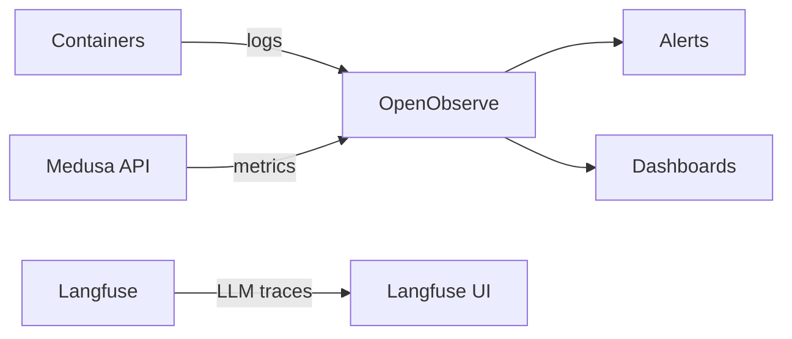

# Monitoring

Monitor DivineKart with the OpenObserve service already in the compose stack — logs, metrics, and traces in one place.

## Level 2 — Monitoring flow



## What's already wired

- **OpenObserve** (`openobserve` service, port 5080) — ingests Docker logs + can scrape Prometheus metrics.
- **Langfuse** (`langfuse-web`, port 3000) — LLM traces from AI/WhatsApp features.
- `.env` keys: `ZO_ROOT_USER_EMAIL`, `ZO_ROOT_USER_PASSWORD`, `ZO_HTTP_PORT`, `ZO_HTTP_PORT_INGEST`.

## Access

| UI | URL | Credentials |
|----|-----|-------------|
| OpenObserve | `http://<host>:5080` | `ZO_ROOT_USER_EMAIL` / `ZO_ROOT_USER_PASSWORD` |
| Langfuse | `http://<host>:3000` | `LANGFUSE_*` keys |
| MinIO console | `http://<host>:9001` | `MINIO_ROOT_USER` / `MINIO_ROOT_PASSWORD` |

## Step 1 — Verify logs are flowing

```bash
docker compose logs -f openobserve
curl -s http://localhost:5080/api/health
```

Open the OpenObserve UI → **Streams** → confirm `default` stream shows container logs.

## Step 2 — Docker log ingestion

OpenObserve's compose config already links the Docker socket for log collection. Verify the stream names match the service names (backend, storefront, postgres, ...) and that **logs are searchable**:

- Filter `service_name: backend` and `level: ERROR` to find errors.
- Save a **Saved View** for daily error review.

## Step 3 — Dashboards & alerts

1. **Dashboards → New** — panels for: request count, error rate, disk usage, 5xx spikes.
2. **Alerts → New** — examples:
   - `error count > 50 in 5m` → email/webhook
   - `service down` (no logs in 10m) → webhook to WhatsApp/Discord
3. Add a **Webhook Alert** — the [WhatsApp integration](../integrations/whatsapp.md) can receive alerts via its webhook.

## Step 4 — Uptime checks (optional)

Add an external uptime probe (UptimeRobot, Better Uptime, or Hetzner monitoring) hitting `https://your-domain.com/health` — catches full outages OpenObserve can't (e.g. network partition).

## Verification checklist

- [ ] OpenObserve UI reachable behind the [reverse proxy](../infra/reverse-proxy-tls.md)
- [ ] Logs searchable per service
- [ ] At least one alert configured
- [ ] External uptime probe on `/health`