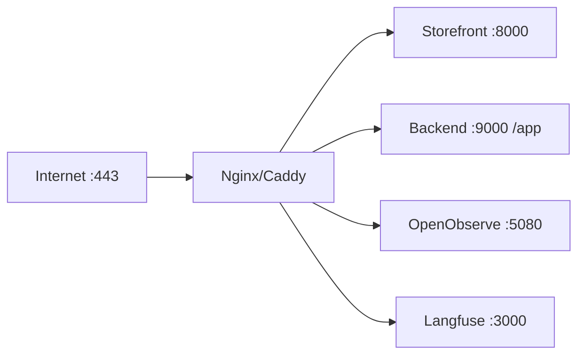

# Reverse Proxy & TLS

Put Nginx (or Caddy) in front of the DivineKart compose stack and terminate TLS with Let's Encrypt.

## Level 2 — Reverse proxy flow



## Option A — Caddy (simplest, auto-TLS)

Caddy auto-provisions and renews Let's Encrypt certs with zero config beyond the Caddyfile.

**`Caddyfile`** (in a `caddy/` folder next to `docker-compose.yml`):

```
your-domain.com {
    encode gzip
    reverse_proxy storefront:8000
    handle_path /app/* {
        reverse_proxy backend:9000
    }
    handle /health {
        reverse_proxy backend:9000
    }
}

admin.your-domain.com {
    reverse_proxy backend:9000
}

obs.your-domain.com {
    reverse_proxy openobserve:5080
}

lf.your-domain.com {
    reverse_proxy langfuse-web:3000
}
```

Add to compose:

```yaml
  caddy:
    image: caddy:2
    ports:
      - "80:80"
      - "443:443"
    volumes:
      - ./caddy/Caddyfile:/etc/caddy/Caddyfile:ro
      - caddy_data:/data
      - caddy_config:/config
```

```bash
docker compose up -d caddy
```

## Option B — Nginx + certbot

**`nginx/conf.d/divinekart.conf`**:

```nginx
server {
    listen 80;
    server_name your-domain.com;
    return 301 https://$host$request_uri;
}

server {
    listen 443 ssl http2;
    server_name your-domain.com;

    ssl_certificate     /etc/letsencrypt/live/your-domain.com/fullchain.pem;
    ssl_certificate_key /etc/letsencrypt/live/your-domain.com/privkey.pem;

    location / {
        proxy_pass http://storefront:8000;
        proxy_set_header Host $host;
        proxy_set_header X-Real-IP $remote_addr;
        proxy_set_header X-Forwarded-Proto $scheme;
    }

    location /app/ {
        proxy_pass http://backend:9000;
        proxy_set_header Host $host;
    }

    location /health {
        proxy_pass http://backend:9000;
    }
}
```

Issue the cert:

```bash
sudo apt install -y certbot python3-certbot-nginx
sudo certbot --nginx -d your-domain.com -d admin.your-domain.com
```

Certbot auto-renews via systemd timer; reload Nginx: `sudo systemctl reload nginx`.

## TLS hardening (both options)

Add to the server block / Caddy global options:

- TLS 1.2 minimum (drop TLS 1.0/1.1)
- HSTS header (`Strict-Transport-Security: max-age=31536000; includeSubDomains`)
- OCSP stapling

See the [Security hardening guide](../security/hardening.md) for the full checklist.

## Post-change verification

- [ ] `https://your-domain.com` loads without cert warnings
- [ ] `/app` admin console loads over HTTPS
- [ ] `curl -I https://your-domain.com` shows `HTTP/2` + HSTS header
- [ ] Cert auto-renewal works: `certbot renew --dry-run` (Nginx) or Caddy does it automatically