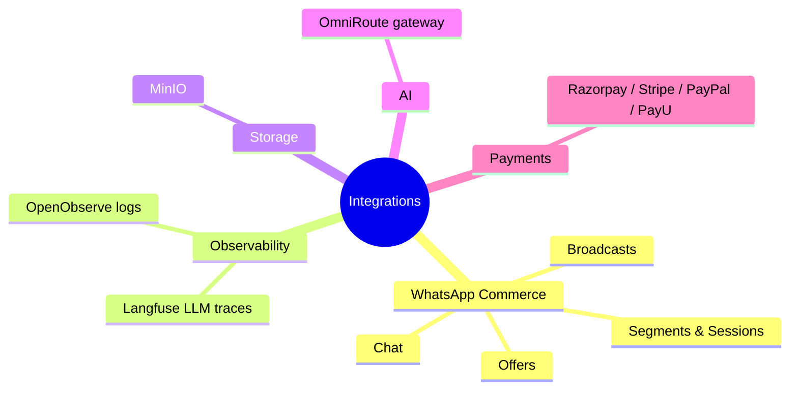
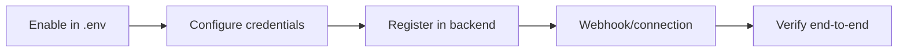

# Integrations Setup

Wire optional integrations into DivineKart — WhatsApp commerce, LLM observability, object storage, and the AI gateway.

## Level 1 — Integration map

## Level 2 — Per-integration flow

## Guides

| Integration | Guide | Status in repo |
|-------------|-------|----------------|
| WhatsApp Business | [whatsapp.md](whatsapp.md) | Implemented (admin routes + webhook) |
| Langfuse (LLM observability) | [langfuse.md](langfuse.md) | Wired (compose service + env) |
| OpenObserve (logs/metrics) | [openobserve.md](openobserve.md) | Wired (compose service + env) |
| MinIO (object storage) | [minio.md](minio.md) | Wired (compose service + env) |
| OmniRoute (AI gateway) | [omniroute.md](omniroute.md) | Wired (compose service + env) |

> Payments are covered in the dedicated [payments guide](../payments/README.md).

## Enabling an integration

All integrations follow the same pattern:

1. Set the relevant `*_*` env vars in `.env` (see the table below).
2. Restart the affected service: `docker compose restart backend` (or `up -d` if adding a service).
3. Verify via the linked guide's checklist.

| Integration | Key env vars |
|-------------|--------------|
| WhatsApp | Meta App credentials, verify token, webhook secret |
| Langfuse | `LANGFUSE_PUBLIC_KEY`, `LANGFUSE_SECRET_KEY`, `LANGFUSE_*` DB keys |
| OpenObserve | `ZO_ROOT_USER_EMAIL`, `ZO_ROOT_USER_PASSWORD`, `ZO_*` ports |
| MinIO | `MINIO_ROOT_USER`, `MINIO_ROOT_PASSWORD` |
| OmniRoute | `OMNIROUTE_API_KEY`, `OMNIROUTE_PORT`, `OMNIROUTE_WS_PORT` |

Each guide below gives the step-by-step setup and a verification checklist.