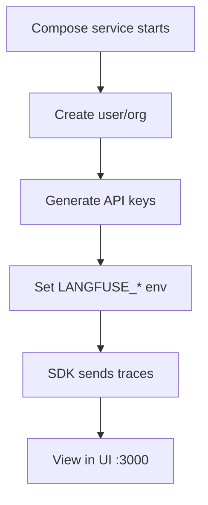

# Langfuse Integration

Langfuse is the LLM observability platform in the DivineKart stack — trace AI/agent calls from the AI gateway and WhatsApp features.

## Level 3 — Langfuse setup



## Step 1 — Start Langfuse

Langfuse runs as `langfuse-web`, `langfuse-worker`, and `langfuse-db` in the compose stack:

```bash
docker compose up -d langfuse-db langfuse-web langfuse-worker
```

UI: `http://localhost:3000` (behind [reverse proxy](../infra/reverse-proxy-tls.md) at `lf.your-domain.com` in production).

## Step 2 — Create account & keys

1. Open the Langfuse UI → **Sign up** (first user becomes admin).
2. **Settings → API Keys → Create new API key**.
3. Note **Public Key**, **Secret Key**, and the project's host.

## Step 3 — Configure `.env`

```dotenv
LANGFUSE_PUBLIC_KEY=pk-lf-xxxxxxxx
LANGFUSE_SECRET_KEY=sk-lf-xxxxxxxx
NEXT_PUBLIC_LANGFUSE_HOST=http://localhost:3000
```

The database backing vars are already set for the self-hosted compose service:

```dotenv
LANGFUSE_POSTGRES_DB=langfuse
LANGFUSE_POSTGRES_USER=langfuse
LANGFUSE_DATABASE_URL=postgresql://...langfuse...
LANGFUSE_ENCRYPTION_KEY=...
LANGFUSE_KEY_DERIVATION_KEY=...
LANGFUSE_SALT=...
```

## Step 4 — Send traces

The backend uses the Langfuse SDK to trace AI calls (OmniRoute, WhatsApp). Set the keys, restart:

```bash
docker compose restart backend
```

## Step 5 — Verify

1. Trigger an AI/WhatsApp feature.
2. Open the Langfuse UI → **Traces** — the trace should appear with spans (model call, latency, token counts).

## Notes & gotchas

- **Keep keys consistent** between the UI project and `.env` — a mismatch yields "invalid API key" and no traces.
- Self-hosted DB: `langfuse-db` is a separate Postgres — don't point `LANGFUSE_DATABASE_URL` at the main `DATABASE_URL`.
- **Encryption/derivation keys** must be stable across restarts or past traces become unreadable — set them once, keep them.

## Verification checklist

- [ ] UI reachable at `:3000` (or `lf.your-domain.com`)
- [ ] API keys created and set in `.env`
- [ ] A trace appears after triggering an AI feature
- [ ] Latency/token metrics visible in the trace detail