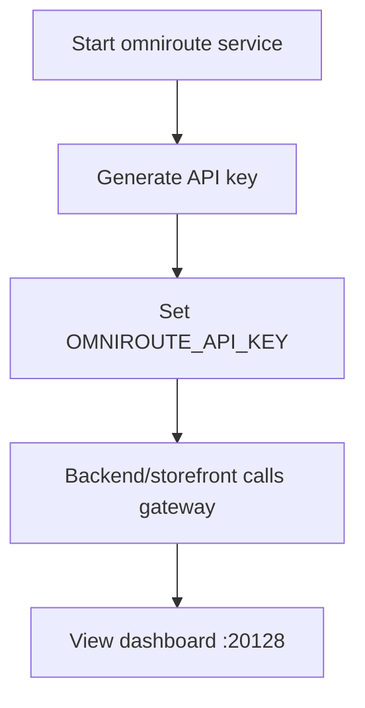

# OmniRoute AI Gateway Integration

OmniRoute is the AI gateway in the DivineKart stack — it routes inference to the best model automatically. This is the same gateway used by the project's development agents.

## Level 3 — OmniRoute setup



## Step 1 — Start OmniRoute

```bash
docker compose up -d omniroute
```

Ports (from `.env`):

- `OMNIROUTE_PORT` — HTTP API (`http://localhost:20128/v1`)
- `OMNIROUTE_WS_PORT` — WebSocket

## Step 2 — Get an API key

Generate/reuse an OmniRoute API key (the repo `.env` has `OMNIROUTE_API_KEY`). Keys authenticate requests to `http://localhost:20128/v1`.

## Step 3 — Configure `.env`

```dotenv
OMNIROUTE_API_KEY=sk-xxxxxxxx
OMNIROUTE_PORT=20128
OMNIROUTE_WS_PORT=20129
```

Restart consumers: `docker compose restart backend storefront`.

## Step 4 — Route inference

Consumers (backend AI features, WhatsApp, storefront) point at the gateway:

```
baseURL: http://omniroute:20128/v1
model:   auto/best-coding   # or auto/best-reasoning, auto/best-fast, auto/best-chat, auto/best-vision, auto
```

Model routing tiers:

| Model alias | Use for |
|-------------|---------|
| `auto/best-coding` | code generation |
| `auto/best-reasoning` | deep reasoning / debugging |
| `auto/best-fast` | low-latency dispatch |
| `auto/best-chat` | conversational |
| `auto/best-vision` | multimodal/UI review |
| `auto` | balanced fallback |

## Step 5 — Dashboard

Open `http://localhost:20128` (or `http://localhost:20128` behind a proxy) for live usage, quota, and cost analytics.

## Notes & gotchas

- **Internal endpoint** — consumers inside compose use `http://omniroute:20128/v1` (service name), not `localhost`.
- **Key sync** — the gateway and consumers must share the same `OMNIROUTE_API_KEY`.
- **Model fallback** — `auto` routes to the best available model; pin a specific alias for deterministic behavior.
- **Langfuse** — OmniRoute calls can be traced through [Langfuse](langfuse.md) for observability.

## Verification checklist

- [ ] `docker compose ps` shows omniroute up
- [ ] `curl http://localhost:20128/v1/models` returns models (with API key)
- [ ] A backend AI feature returns a completion via the gateway
- [ ] Dashboard shows usage/cost for the call