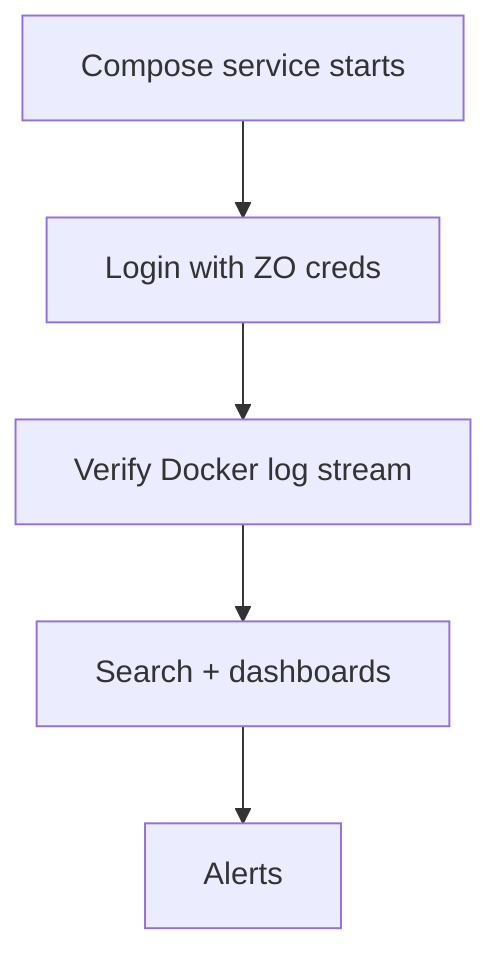

# OpenObserve Integration

OpenObserve (the `openobserve` service) is the logging, metrics, and tracing backend in the DivineKart stack.

## Level 3 — OpenObserve setup



## Step 1 — Start & access

```bash
docker compose up -d openobserve
```

UI: `http://localhost:5080` (behind [reverse proxy](../infra/reverse-proxy-tls.md) at `obs.your-domain.com` in production).

## Step 2 — Login

Use the `.env` credentials:

```dotenv
ZO_ROOT_USER_EMAIL=root@example.com
ZO_ROOT_USER_PASSWORD=<your-password>
```

## Step 3 — Verify log ingestion

OpenObserve is configured to collect Docker container logs via the Docker socket. Confirm:

1. **Streams** → you see streams named after the services (`backend`, `storefront`, `postgres`, ...).
2. **Search** → a query like `service_name:"backend"` returns rows.

If nothing appears, check `docker compose logs openobserve` for socket/permission errors.

## Step 4 — Search & dashboards

- Use the query language to filter: `service_name:"backend" AND level:"error"`.
- Create **Saved Views** for recurring checks.
- Build **Dashboards** for request volume, error rate, disk usage.

## Step 5 — Alerts

Configure alerts for:

- Error count threshold (`count(level="error") > 50` in 5m)
- Service silence (no logs for 10m = likely down)
- Deliver via **webhook** (e.g. to [WhatsApp](whatsapp.md) or Discord/Slack).

## Notes & gotchas

- **Ports**: `ZO_HTTP_PORT` (UI/API) and `ZO_HTTP_PORT_INGEST` (ingestion) are in `.env` — keep them aligned with compose.
- **Docker socket** — OpenObserve needs the socket for log collection; mount it read-only.
- **Data dir** — `ZO_DATA_DIR` should be on a persistent volume.

## Verification checklist

- [ ] UI reachable at `:5080` / `obs.your-domain.com`
- [ ] Login works with `ZO_ROOT_USER_*`
- [ ] Service streams visible and searchable
- [ ] At least one alert configured