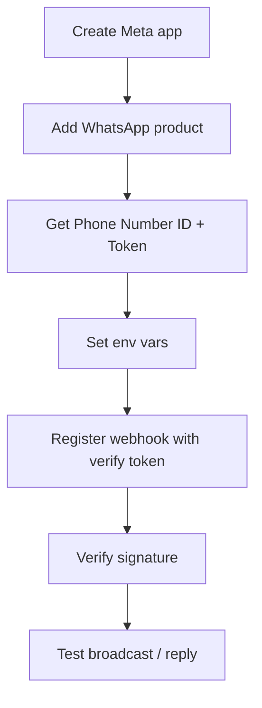

# WhatsApp Business Integration

DivineKart includes a full WhatsApp commerce suite — broadcasts, chat conversations, segments, sessions, and offers — via the Meta WhatsApp Business Cloud API.

## What's implemented

Backend admin routes under `src/api/admin/whatsapp/`:

- **Broadcasts** — `broadcast/`, `broadcasts/`, `broadcasts/[id]/`, `broadcasts/[id]/recipients/`
- **Chat** — `chat/conversations/`, `chat/conversations/[phone]/`, `.../read`, `.../reply`
- **Offers** — `offers/send/`
- **Segments** — `segments/`
- **Sessions** — `sessions/`, `sessions/[id]/`, `sessions/[id]/send/`
- **Catalog** — `catalog/send/`
- **Webhook** — `webhooks/whatsapp/`

## Level 3 — WhatsApp setup



## Step 1 — Meta app + WhatsApp

1. Go to [developers.facebook.com](https://developers.facebook.com) → **Create App** → use-case **Other**.
2. Add the **WhatsApp** product.
3. In WhatsApp → **API Setup**: note your **Phone Number ID** and generate a **Temporary Access Token** (or permanent via a System User).
4. Add a **test number** if you don't have a business number yet.

## Step 2 — Configure `.env`

```dotenv
WHATSAPP_PHONE_NUMBER_ID=xxxxxxxx
WHATSAPP_ACCESS_TOKEN=xxxxxxxx
WHATSAPP_VERIFY_TOKEN=<your-random-verify-token>
WHATSAPP_WEBHOOK_SECRET=<your-random-app-secret>
```

- `WHATSAPP_VERIFY_TOKEN` — a string you choose for the webhook verification handshake.
- `WHATSAPP_WEBHOOK_SECRET` — the Meta App's **App Secret** (Dashboard → App Settings → Basic → App Secret), used to verify incoming webhook signatures.

## Step 3 — Register the webhook

1. Meta app → **WhatsApp → Configuration → Webhook**.
2. **Callback URL**: `https://your-domain.com/api/webhooks/whatsapp`
3. **Verify token**: paste `WHATSAPP_VERIFY_TOKEN`.
4. **Verify and Save**.
5. **Subscribe** to the message/webhook fields (messages, message_deliveries, etc.).

## Step 4 — Verify the signature

The backend's `webhooks/whatsapp/route.ts` validates incoming requests using the App Secret (`WHATSAPP_WEBHOOK_SECRET`). Confirm in `docker compose logs backend` that webhooks are accepted (no `401`/signature failures).

## Step 5 — Test

1. Send a WhatsApp message to your number → confirm it lands in the backend's `chat/conversations/`.
2. In the admin dashboard → WhatsApp → create a broadcast to a segment → send.
3. Verify delivery in the Meta WhatsApp dashboard.

## Notes & gotchas

- **Token expiry** — the temporary access token expires (24h). Use a **System User** token for a long-lived token, or refresh programmatically.
- **Verify token mismatch** — Meta fails the handshake if the callback URL/verify token don't match `.env`; restart backend after changing them.
- **Signature** — never disable signature verification on the webhook.
- **Rate limits** — Meta enforces business-initiated message limits; test broadcasts on small segments first.

## Verification checklist

- [ ] Webhook verified (Meta shows "Active")
- [ ] Inbound message appears in conversations
- [ ] Admin broadcast to a segment delivers
- [ ] Signature verification on (no 401s in logs)