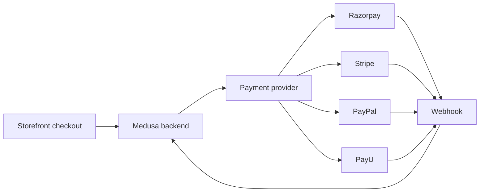
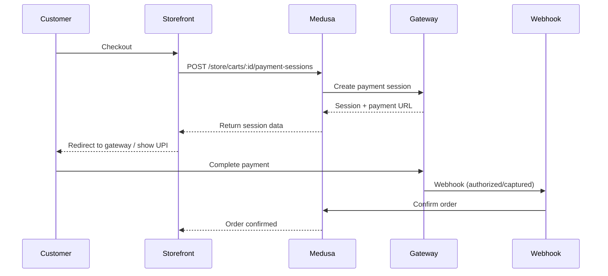

# Payment Gateway Setup

Wire a payment gateway into the DivineKart Medusa backend. Covers the generic Medusa payment-provider pattern plus four gateways: Razorpay, Stripe, PayPal, and PayU.

## Level 1 — Payment architecture

## Level 2 — Generic payment flow (any gateway)

## Level 3 — What every gateway needs

1. **Create an account** at the gateway, get API credentials.
2. **Install the provider package** in `backend/` (or implement the `AbstractPaymentProvider` interface).
3. **Register the provider** in `backend/src/modules/medusa-config.ts` (or the plugins array).
4. **Set env vars** — credentials must live in `.env`, never in code.
5. **Configure the webhook URL** at the gateway to point at `https://your-domain.com/hooks/<provider>`.
6. **Assign the provider to a region** in the admin dashboard → Settings → Regions.

## Guides

| Gateway | Guide |
|---------|-------|
| Razorpay (India, recommended) | [razorpay.md](razorpay.md) |
| Stripe (global) | [stripe.md](stripe.md) |
| PayPal | [paypal.md](paypal.md) |
| PayU (India) | [payu.md](payu.md) |

## Which one to pick?

- **India-first store** → **Razorpay** (UPI, cards, netbanking, wallets — all native).
- **Global customers** → **Stripe** (best DX, global coverage, local payment methods).
- **Brand trust + installments** → **PayPal** (or PayPal alongside another).
- **Budget INR processing** → **PayU** (competitive MDR, EMI options).

> **Production warning:** only enable the real gateway after the store is behind HTTPS with a verified webhook — test-mode keys are for staging only. See the [security guide](../security/README.md).