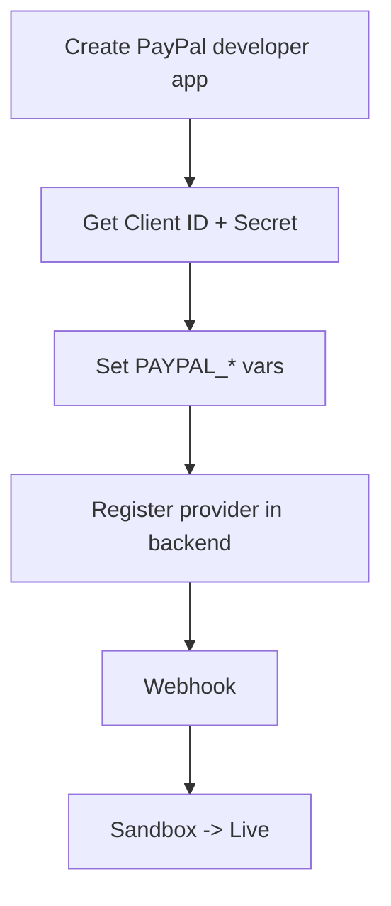

# PayPal Integration

Add PayPal as a payment method for DivineKart — ideal for brand trust, international buyers, and installment/BNPL options.

## Level 3 — PayPal setup



## Step 1 — Get credentials

1. [developer.paypal.com](https://developer.paypal.com) → **Apps & Credentials**.
2. Create a **REST app** → get **Client ID** and **Secret**.
3. Switch the app to **Live** mode when ready (separate live credentials).

## Step 2 — Configure `.env`

```dotenv
PAYPAL_CLIENT_ID=xxxxxxxx
PAYPAL_CLIENT_SECRET=xxxxxxxx
PAYPAL_WEBHOOK_ID=xxxxxxxx
```

## Step 3 — Register the provider

```bash
cd backend
pnpm add medusa-payment-paypal
```

In `medusa-config.ts`:

```ts
plugins: [
  // ...
  {
    resolve: "medusa-payment-paypal",
    options: {
      client_id: process.env.PAYPAL_CLIENT_ID,
      client_secret: process.env.PAYPAL_CLIENT_SECRET,
      auth_webhook_id: process.env.PAYPAL_WEBHOOK_ID,
    },
  },
],
```

Restart: `docker compose restart backend`.

## Step 4 — Webhook

1. PayPal dashboard → app → **Webhooks → Add Webhook**.
2. URL: `https://your-domain.com/hooks/paypal`
3. Events: `PAYMENT.CAPTURE.COMPLETED`, `PAYMENT.CAPTURE.DENIED`, `CHECKOUT.ORDER.APPROVED`.
4. Note the generated **Webhook ID** → set `PAYPAL_WEBHOOK_ID`.

## Step 5 — Assign to region

Admin → **Settings → Regions** → enable PayPal.

## Step 6 — Test → Live

- Use **Sandbox** credentials + PayPal sandbox buyer accounts.
- Switch to **Live** credentials when ready.

## Verification checklist

- [ ] Sandbox checkout completes
- [ ] Capture webhook flips order to paid
- [ ] Live Client ID/Secret set
- [ ] Live webhook ID registered