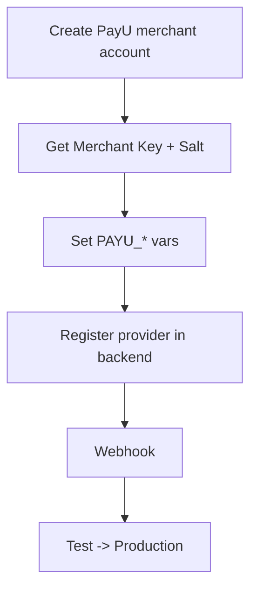

# PayU Integration

Add PayU (India) as a payment method — competitive MDR and EMI options for INR processing.

## Level 3 — PayU setup



## Step 1 — Get credentials

1. Sign up at [payu.in](https://payu.in) as a merchant.
2. From the dashboard/onboarding, obtain **Merchant Key** and **Merchant Salt**.
3. PayU provides a **test** environment with a test merchant key/salt for staging.

## Step 2 — Configure `.env`

```dotenv
PAYU_MERCHANT_KEY=xxxxxxxx
PAYU_MERCHANT_SALT=xxxxxxxx
PAYU_ENV=test          # switch to prod when ready
```

## Step 3 — Register the provider

```bash
cd backend
pnpm add medusa-payment-payu
```

In `medusa-config.ts`:

```ts
plugins: [
  // ...
  {
    resolve: "medusa-payment-payu",
    options: {
      merchant_key: process.env.PAYU_MERCHANT_KEY,
      merchant_salt: process.env.PAYU_MERCHANT_SALT,
      env: process.env.PAYU_ENV, // "test" | "prod"
    },
  },
],
```

Restart: `docker compose restart backend`.

## Step 4 — Webhook / hash verification

PayU uses **hash verification** (SHA-512 of parameters + salt) instead of a simple webhook secret. Ensure the provider validates the hash on the return/callback URLs, and register the success/failure return URLs at PayU:

- `https://your-domain.com/hooks/payu/success`
- `https://your-domain.com/hooks/payu/failure`

## Step 5 — Assign to region

Admin → **Settings → Regions** → enable PayU for the INR region.

## Step 6 — Test → Production

- Validate the full flow in **test** mode (PayU test cards).
- Switch `PAYU_ENV=prod` with live key/salt when ready.

## Verification checklist

- [ ] Test transaction completes and order is captured
- [ ] Hash verification passes (no failed-callback loops)
- [ ] Success/failure return URLs registered
- [ ] Production key/salt + `PAYU_ENV=prod`