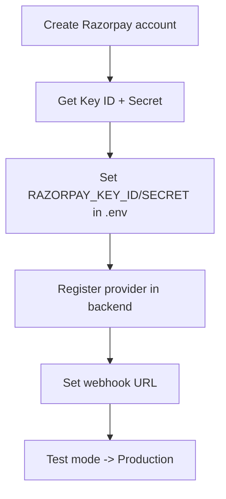

# Razorpay Integration

Razorpay is the recommended gateway for an India-first DivineKart store — UPI, cards, netbanking, and wallets all supported natively.

## Already wired

The repo already references Razorpay — `.env` contains `RAZORPAY_KEY_ID` and `RAZORPAY_KEY_SECRET`.

## Level 3 — Razorpay setup



## Step 1 — Get credentials

1. Sign up at [dashboard.razorpay.com](https://dashboard.razorpay.com).
2. **Settings → API Keys → Generate Key**.
3. Copy **Key ID** and **Key Secret**.

## Step 2 — Configure `.env`

```dotenv
RAZORPAY_KEY_ID=rzp_test_xxxxxxxxxxxxxxxx
RAZORPAY_KEY_SECRET=xxxxxxxxxxxxxxxx
```

## Step 3 — Register the provider

In `backend/`, install the Medusa Razorpay plugin (if using one) or register the provider. Example using `medusa-payment-razorpay`:

```bash
cd backend
pnpm add medusa-payment-razorpay
```

Then in `medusa-config.ts` plugins array:

```ts
plugins: [
  // ...existing plugins
  {
    resolve: "@medusajs/medusa-payment-razorpay",
    options: {
      api_key: process.env.RAZORPAY_KEY_ID,
      api_secret: process.env.RAZORPAY_KEY_SECRET,
      webhook_secret: process.env.RAZORPAY_WEBHOOK_SECRET,
    },
  },
],
```

Restart the backend: `docker compose restart backend`.

## Step 4 — Webhook

1. Razorpay dashboard → **Settings → Webhooks → Add Webhook**.
2. URL: `https://your-domain.com/hooks/razorpay`
3. Events: `payment.authorized`, `payment.captured`, `payment.failed`.
4. Set a **webhook secret** and mirror it in `RAZORPAY_WEBHOOK_SECRET`.

## Step 5 — Assign to region

Admin dashboard → **Settings → Regions** → edit your India/INR region → enable **Razorpay** as the payment provider.

## Step 6 — Test → Production

- Test with `rzp_test_` keys on `https://your-domain.com`.
- Switch to `rzp_live_` keys + **live mode** webhook only when ready.

## Verification checklist

- [ ] Test checkout completes end-to-end (mock/test card)
- [ ] Order status flips to `captured`/`fulfilled` after webhook
- [ ] Webhook events visible in Razorpay dashboard
- [ ] Production keys set + HTTPS verified