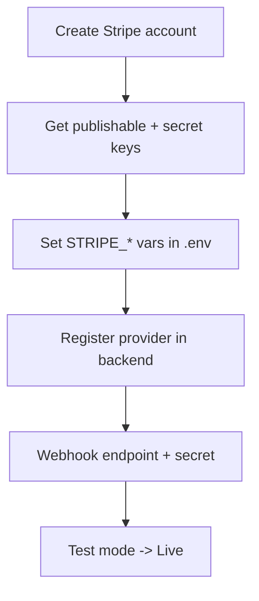

# Stripe Integration

Stripe is the best choice for a global audience — great developer experience and broad international payment-method coverage.

## Level 3 — Stripe setup



## Step 1 — Get credentials

1. [dashboard.stripe.com](https://dashboard.stripe.com) → **Developers → API keys**.
2. Note **Publishable key** (`pk_test_...`) and **Secret key** (`sk_test_...`).

## Step 2 — Configure `.env`

```dotenv
STRIPE_PUBLISHABLE_KEY=pk_test_xxxxxxxx
STRIPE_SECRET_KEY=sk_test_xxxxxxxx
STRIPE_WEBHOOK_SECRET=whsec_xxxxxxxx
```

## Step 3 — Register the provider

```bash
cd backend
pnpm add medusa-payment-stripe
```

In `medusa-config.ts`:

```ts
plugins: [
  // ...
  {
    resolve: "medusa-payment-stripe",
    options: {
      api_key: process.env.STRIPE_SECRET_KEY,
      webhook_secret: process.env.STRIPE_WEBHOOK_SECRET,
    },
  },
],
```

Restart: `docker compose restart backend`.

## Step 4 — Webhook

1. Stripe → **Developers → Webhooks → Add endpoint**.
2. URL: `https://your-domain.com/hooks/stripe`
3. Events: `checkout.session.completed`, `payment_intent.succeeded`, `payment_intent.payment_failed`.
4. Stripe provides the `whsec_...` signing secret → set `STRIPE_WEBHOOK_SECRET`.

## Step 5 — Assign to region

Admin → **Settings → Regions** → add Stripe to your regions (INR + any international regions).

## Step 6 — Test → Live

- Use `pk_test_`/`sk_test_` + test card `4242 4242 4242 4242`.
- Flip to live keys when production-ready.

## Verification checklist

- [ ] Test checkout passes with test card
- [ ] Webhook verifies signature (no `401` in backend logs)
- [ ] Order captured after `payment_intent.succeeded`
- [ ] Live keys + live webhook endpoint in place