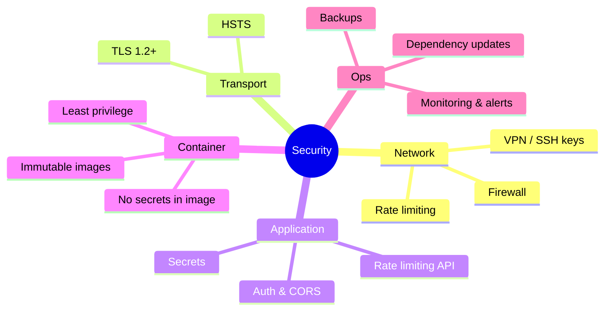
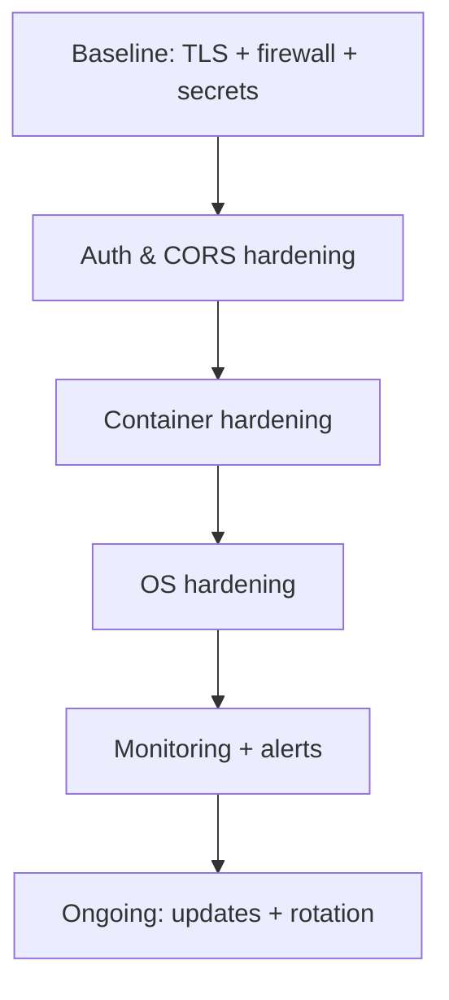

# Security Setup & Hardening

Harden the DivineKart deployment from baseline setup to production-grade hardening.

## Level 1 — Security layers

## Level 2 — Hardening flow

## Guides

| Topic | Guide |
|-------|-------|
| Baseline security setup | [setup.md](setup.md) |
| Production hardening | [hardening.md](hardening.md) |

## Minimum baseline (before going live)

1. **HTTPS everywhere** — follow [reverse proxy & TLS](../infra/reverse-proxy-tls.md); never expose the backend on plain HTTP.
2. **Change default admin credentials** — don't ship with `supersecret`.
3. **Strong secrets** in `.env` — regenerate `JWT_SECRET`, `COOKIE_SECRET`, `LANGFUSE_*`, `MINIO_*`, `ZO_*`, `OMNIROUTE_API_KEY`; never commit `.env`.
4. **Firewall** — only open 22/80/443 (see [hardening.md](hardening.md)).
5. **Backups** — configure per [backups guide](../infra/backups.md).
6. **HTTPS-only webhook verification** — all payment gateways must verify signatures (see [payments](../payments/README.md)).

## Reporting a vulnerability

Use GitHub **Security Advisories** (`Security → Advisories → New advisory`) — do **not** open a public issue.