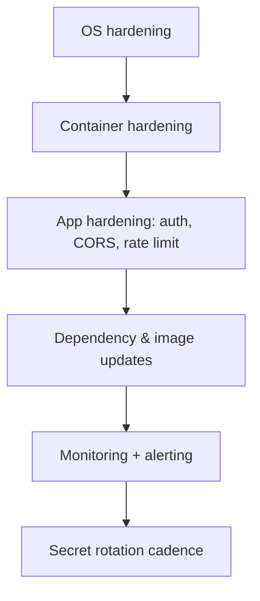

# Production Security Hardening

Beyond the [baseline](setup.md) — deeper hardening for a production store.

## Level 3 — Hardening checklist flow



## 1. OS hardening

- **Automatic security updates**:
  ```bash
  sudo apt install -y unattended-upgrades
  sudo dpkg-reconfigure -plow unattended-upgrades   # enable
  ```
- **SSH hardening** (`/etc/ssh/sshd_config`):
  ```ini
  PermitRootLogin no
  PasswordAuthentication no
  PubkeyAuthentication yes
  MaxAuthTries 3
  ```
  Restart: `sudo systemctl restart ssh`.
- **fail2ban** (brute-force protection):
  ```bash
  sudo apt install -y fail2ban
  sudo systemctl enable --now fail2ban
  ```
- **Keep the OS patched** — a weekly `apt update && apt upgrade` or an update task.

## 2. Container hardening

- **Run as non-root** — the compose services should not run as root inside containers. Verify with `docker compose exec backend whoami`.
- **Read-only root filesystems** where supported.
- **Pin image tags** — use specific versions, not `latest`, for reproducibility.
- **Never bake secrets into images** — secrets come from `.env`/env vars at runtime, never `COPY`'d or `ENV`-hardcoded in Dockerfiles.
- **Least-privilege networks** — restrict service-to-service networking to what's needed; don't expose Postgres/Redis/MinIO on the public host interface (bind to internal/loopback only).
- **Docker socket** — only OpenObserve (log collection) needs the socket; keep it read-only.

## 3. Application hardening (Medusa / Next.js)

- **CORS** — keep `STORE_CORS` / `ADMIN_CORS` / `AUTH_CORS` scoped to your actual origins, not `*`.
- **Rate limiting** — put rate limiting in front of the API (reverse proxy) for login, auth, and `/store/*` endpoints.
- **Auth** — enforce strong admin passwords, restrict admin console to your IP via firewall/proxy.
- **Security headers** via the reverse proxy:
  ```
  X-Frame-Options: DENY
  X-Content-Type-Options: nosniff
  Referrer-Policy: strict-origin-when-cross-origin
  Content-Security-Policy: default-src 'self'
  Strict-Transport-Security: max-age=31536000; includeSubDomains
  ```
- **WhatsApp webhook** — the `/api/webhooks/whatsapp` endpoint must verify Meta's signature/verify-token (see [WhatsApp integration](../integrations/whatsapp.md)).

## 4. Dependencies & images

- **Dependabot** — already configured (`npm` + `github-actions`, weekly). Review and merge dependency PRs promptly.
- **CodeQL** — already enabled (`codeql-analysis.yml`) — watch its alerts.
- **Vulnerability scanning** — periodically `docker scout` or `trivy image` the backend/storefront images.
- **Image provenance** — pull only from GHCR/trusted registries.

## 5. Monitoring & alerting

- Configure [OpenObserve monitoring](../infra/monitoring.md) with alerts for error spikes and service downtime.
- Add an external uptime probe on `/health`.
- Alert on auth-failure bursts (fail2ban + OpenObserve).

## 6. Secret rotation cadence

| Secret | Rotate |
|--------|--------|
| JWT / COOKIE secret | every 90 days + on any suspected leak |
| Gateway keys | immediately on suspicion |
| Database password | quarterly |
| Admin password | quarterly |

Set a recurring reminder — put it on the calendar.

## Hardening checklist

- [ ] OS auto-updates enabled, SSH key-only, root login disabled
- [ ] fail2ban active
- [ ] Containers non-root, images pinned, no secrets in images
- [ ] CORS scoped; rate limiting in front of API; security headers set
- [ ] Dependabot PRs reviewed; CodeQL alerts triaged
- [ ] Monitoring alerts firing on error/downtime
- [ ] Rotation schedule on the calendar