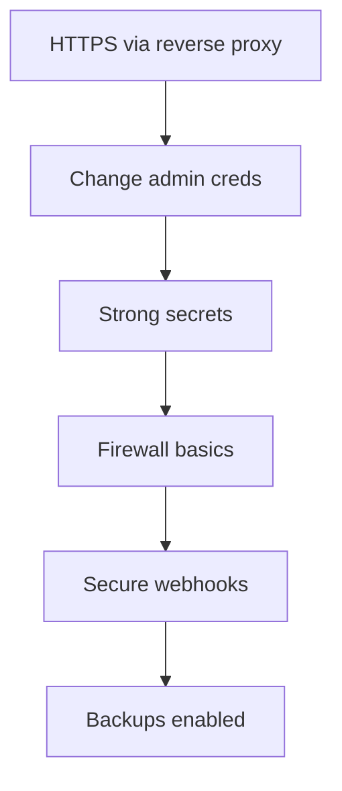

# Baseline Security Setup

The security baseline every DivineKart deployment must have before going live.

## Level 3 — Baseline flow



## 1. HTTPS everywhere

Expose the store only through a TLS-terminating [reverse proxy](../infra/reverse-proxy-tls.md). The Medusa backend (9000), OpenObserve (5080), and Langfuse (3000) must **never** be reachable directly on public HTTP — keep them internal-only or behind `admin.your-domain.com` with auth.

## 2. Change default admin credentials

The seeded default is `admin@divinekart.com` / `supersecret` — **change it before going live**:

```dotenv
MEDUSA_ADMIN_EMAIL=real-admin@your-domain.com
MEDUSA_ADMIN_PASSWORD=<long-random-password>
```

Then reseed or update via the admin dashboard. Use a password manager to generate/store it.

## 3. Regenerate secrets

Generate fresh values for every secret in `.env` — never use example/default values:

```bash
openssl rand -base64 48   # JWT_SECRET, COOKIE_SECRET
openssl rand -hex 32      # LANGFUSE_ENCRYPTION_KEY, LANGFUSE_KEY_DERIVATION_KEY
```

Rotate: `JWT_SECRET`, `COOKIE_SECRET`, `LANGFUSE_SECRET_KEY`, `MINIO_ROOT_PASSWORD`, `ZO_ROOT_USER_PASSWORD`, `OMNIROUTE_API_KEY`.

> **Never commit `.env`.** Add `.env` to `.gitignore` (already the case). Store production secrets in a secret manager or a private, access-controlled file.

## 4. Firewall basics

Only expose ports 22 (SSH), 80, 443. Use the provider firewall or `ufw`:

```bash
sudo ufw default deny incoming
sudo ufw allow OpenSSH
sudo ufw allow 'Nginx Full'   # 80 + 443
sudo ufw allow from <your-ip> to any port 9000 proto tcp   # restrict admin console
sudo ufw enable
```

Also restrict the aaPanel panel port (8888) and OpenObserve (5080) to your IP only.

## 5. Secure webhooks

- All payment webhooks must verify signatures/hashes (Razorpay/Stripe/PayPal/PayU — see [payments](../payments/README.md)).
- Use `https://` webhook URLs only.
- Restrict webhook routes to known gateway IPs/User-Agents where the gateway supports it.

## 6. Enable backups

Configure [backups](../infra/backups.md) with off-site storage before launch — you can't harden your way out of data loss.

## Baseline checklist

- [ ] HTTPS with valid Let's Encrypt cert (no warnings)
- [ ] Admin credentials changed
- [ ] All secrets regenerated; `.env` not committed
- [ ] Firewall allows only 22/80/443 (+ admin IPs)
- [ ] Webhooks verify signatures
- [ ] Nightly backups + off-site sync running