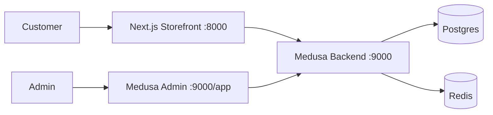
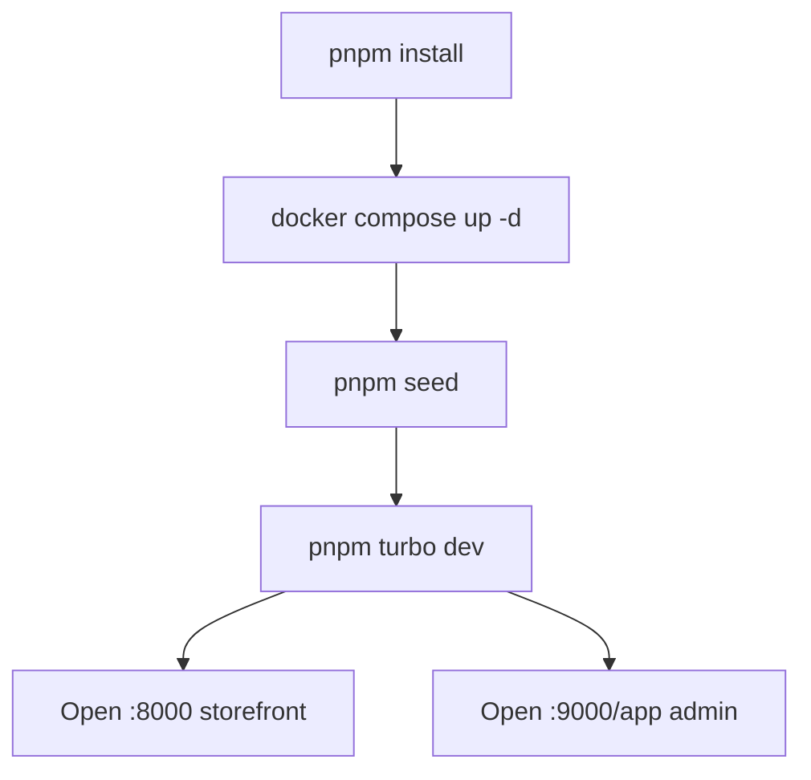

# Storefront & Admin Setup

Guide for the DivineKart Next.js storefront and the Medusa admin dashboard — local development, production build, and day-to-day admin operations.

## Level 1 — Storefront & admin overview



## Level 2 — Local development flow



## Storefront (Next.js)

### Local dev

```bash
pnpm install
docker compose up -d backend postgres redis minio
pnpm seed
pnpm turbo dev
# Storefront: http://localhost:8000
```

Key storefront env vars (see `.env`):

| Var | Purpose |
|-----|---------|
| `NEXT_PUBLIC_MEDUSA_BACKEND_URL` | Browser-side backend URL (`http://localhost:9000`) |
| `MEDUSA_BACKEND_URL` | Server-side URL (`http://backend:9000` in container) |
| `NEXT_PUBLIC_MEDUSA_PUBLISHABLE_KEY` | Publishable key for `/store/*` |
| `NEXT_PUBLIC_STORE_NAME` | Store branding |

### Production build

```bash
pnpm --filter divinekart-storefront build
pnpm --filter divinekart-storefront start   # port 8000
```

> **Important:** the storefront is **SSR** (server-side rendering), not static export. It fetches from the backend at request time, so `MEDUSA_BACKEND_URL` must be reachable from the storefront container/server.

### Mock fallback (first boot)

`storefront/src/lib/medusa.ts` contains a load-bearing mock fallback used for first-boot rendering before the backend is ready. **Keep it** — the storefront renders immediately even if the backend hasn't finished seeding.

## Medusa Admin Dashboard

### Access

- **URL**: `http://localhost:9000/app` (or `/app` on your domain behind the [reverse proxy](../infra/reverse-proxy-tls.md))
- **Default admin**: `admin@divinekart.com` / `supersecret` (set via `MEDUSA_ADMIN_EMAIL` / `MEDUSA_ADMIN_PASSWORD`)

### Modules & routes

The backend registers admin routes under `src/api/admin/` and UI routes under `src/admin/routes/`:

| Area | Routes |
|------|--------|
| **Settings** | `admin/settings/*` |
| **WhatsApp** | `admin/whatsapp/*` (broadcasts, chat, segments, sessions, offers) |

### Seed workflow

```bash
pnpm seed
# or inside a running container:
docker compose exec backend medusa exec ./scripts/seed-data.ts
```

The seed is **idempotent** — it creates (or reuses) the store, India/INR region, 10 collections, 30 published products, default sales channel, and publishable API key. If a key already exists it's reused, so keep `.env`'s publishable key in sync.

## Common admin tasks

- **Regions & currencies**: Settings → Regions → assign payment providers per region.
- **Products & collections**: create/seed products (use `createProductsWorkflow`, never `createProducts`).
- **Orders**: view, capture payments, fulfill, mark shipped.
- **Customers & sales channels**: manage the default channel and publishable keys.
- **Integrations**: WhatsApp broadcasts/chat, payment gateways, AI features.

## Troubleshooting

| Symptom | Fix |
|---------|-----|
| Storefront renders but no products | Run `pnpm seed`; verify `NEXT_PUBLIC_MEDUSA_PUBLISHABLE_KEY` matches the seeded key |
| Admin 401 / wrong creds | Check `MEDUSA_ADMIN_EMAIL`/`MEDUSA_ADMIN_PASSWORD` in `.env`, reseed |
| CORS errors from browser | Verify `STORE_CORS`/`ADMIN_CORS`/`AUTH_CORS` include the storefront origin |
| Storefront can't reach backend | `MEDUSA_BACKEND_URL` must be the internal `http://backend:9000` in-container, not `localhost` |
| Mock fallback showing | Backend not ready yet — check `docker compose logs backend` for seed completion |