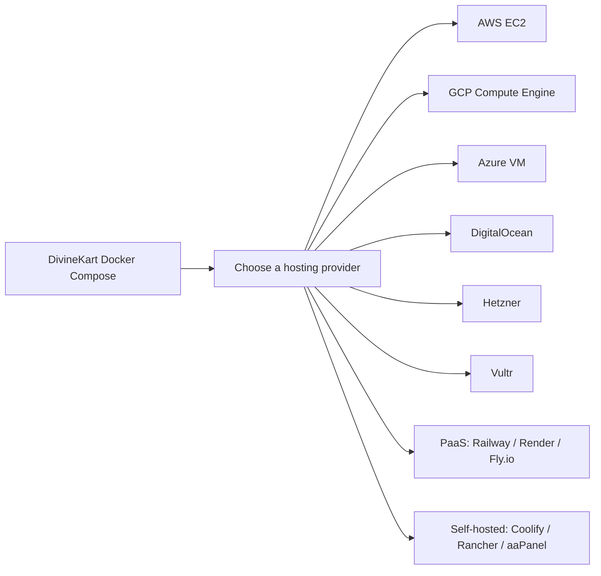
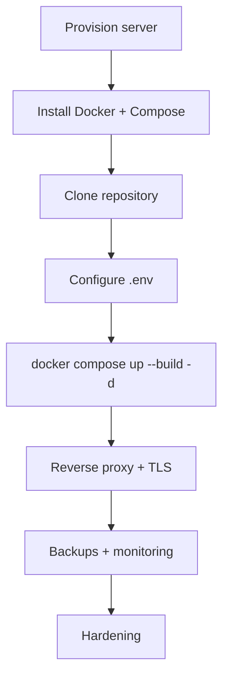

# VPS & Infrastructure Setup

Deploy DivineKart on any major cloud provider — hyperscalers, budget VPS providers, platform-as-a-service, or self-hosted control planes.

## Level 1 — Provider overview

## Level 2 — Common flow (any provider)

## Guides

### Hyperscalers

| Provider | Guide | Notes |
|----------|-------|-------|
| AWS | [AWS EC2](aws-ec2.md) | t3.medium+, free tier eligible for small stores |
| GCP | [GCP Compute Engine](gcp-compute-engine.md) | e2-medium+, 750h/mo free tier |
| Azure | [Azure VM](azure-vm.md) | Standard B2s, $200 new-account credit |

### Budget VPS

| Provider | Guide | Notes |
|----------|-------|-------|
| DigitalOcean | [DigitalOcean Droplet](digitalocean.md) | $6/mo droplet is a good starting point |
| Hetzner | [Hetzner Cloud](hetzner.md) | Best price/performance in EU |
| Vultr | [Vultr](vultr.md) | $6/mo high-frequency instances |

### Platform-as-a-Service

| Provider | Guide | Notes |
|----------|-------|-------|
| Railway | [Railway](railway.md) | Zero-ops deploys from GitHub |
| Render | [Render](render.md) | Blueprints + private services |
| Fly.io | [Fly.io](fly.io.md) | Global edge deployment |

### Self-hosted control planes

| Tool | Guide | Notes |
|------|-------|-------|
| Coolify | [Coolify](coolify.md) | Open-source PaaS on your own VPS |
| Rancher | [Rancher](rancher.md) | Kubernetes management |
| aaPanel | [aaPanel](aapanel.md) | Lightweight web panel with Docker UI |

### Shared infrastructure

| Topic | Guide |
|-------|-------|
| Reverse proxy + TLS (Nginx/Caddy) | [Infra: reverse proxy & TLS](../infra/reverse-proxy-tls.md) |
| Backups (Postgres + volumes) | [Infra: backups](../infra/backups.md) |
| Monitoring (OpenObserve) | [Infra: monitoring](../infra/monitoring.md) |
| Domains & DNS | [Infra: domains & DNS](../infra/domains-dns.md) |