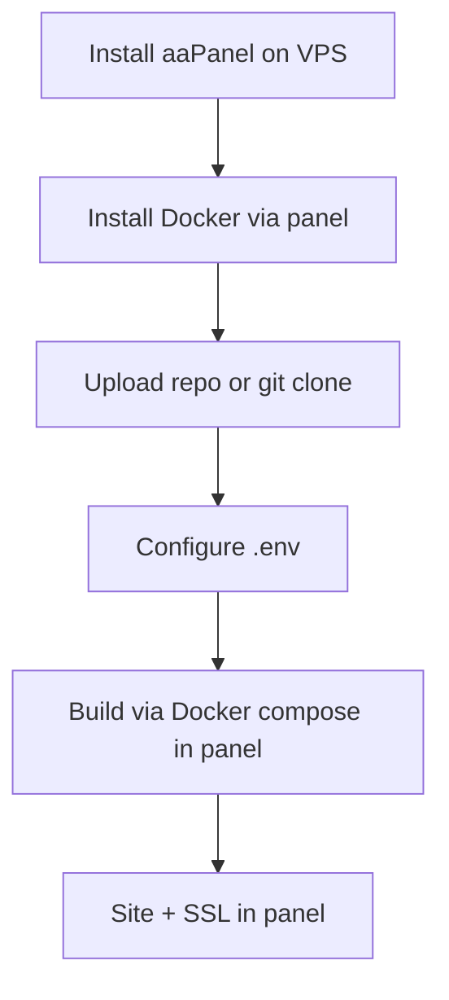

# aaPanel Deployment

Deploy DivineKart on aaPanel (formerly BaoTa) — a lightweight web control panel with a built-in Docker manager, ideal for managed VPS setups on a budget.

## Level 2 — aaPanel-specific flow



## Step 1 — Install aaPanel

On a fresh Ubuntu 22.04 VPS:

```bash
wget -O install.sh https://www.aapanel.com/script/install_6.0_en.sh
bash install.sh
```

Save the login URL, username, and password printed at the end, then log in.

## Step 2 — Enable Docker

**App Store → search "Docker" → Install**. aaPanel provides a GUI for images, containers, compose, and networks.

## Step 3 — Get the repo onto the server

Two options:

- **Terminal** tab (built-in): `git clone https://github.com/CodeRender7/spiritualEcom.git /www/wwwroot/divinekart`
- Or zip-upload via the **Files** manager.

## Step 4 — Build with Docker compose

```bash
cd /www/wwwroot/divinekart
cp .env.example .env && nano .env   # set real secrets
docker compose up --build -d
docker compose ps
```

## Step 5 — Site & SSL

1. **Websites → Add Site** → domain → `divinekart` → point root at `/www/wwwroot/divinekart`.
2. Set up a **reverse proxy** in the site's settings: proxy to `http://127.0.0.1:8000` (storefront) and `/app` → `http://127.0.0.1:9000`.
3. **SSL → Let's Encrypt → Issue** — aaPanel auto-renews certs.

## Notes & gotchas

- aaPanel's Docker compose support is decent but basic — for complex multi-service debugging use the built-in Terminal.
- The panel's own services (BT-Panel, BT-Task) listen on 8888/888 — restrict this port to your IP via firewall.
- Enable the built-in **firewall** (Settings → Security) and only open 80/443/22.

## Cost estimate

| Resource | ~$/mo |
|----------|-------|
| aaPanel (open source) | $0 |
| VPS (2 vCPU / 4 GB) | $6–24 |