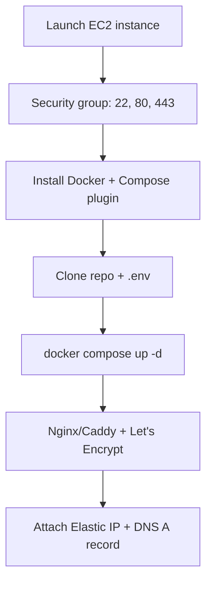

# AWS EC2 Deployment

Deploy DivineKart on AWS EC2 with Docker Compose behind a reverse proxy with TLS.

## Level 2 — AWS-specific flow



## Step 1 — Launch an instance

1. Go to **EC2 → Launch instance** in the AWS Console.
2. **AMI**: Ubuntu 24.04 LTS (free tier eligible).
3. **Instance type**: `t3.medium` (2 vCPU / 4 GiB) minimum for the full compose stack; `t3.large` recommended for production.
4. **Key pair**: create or select one — you'll need it for SSH.
5. **Network settings → Edit**: allow
   - SSH (22) from your IP
   - HTTP (80) and HTTPS (443) from anywhere
6. Launch, then attach an **Elastic IP** (EC2 → Elastic IPs → Allocate → Associate).

## Step 2 — Install Docker

```bash
sudo apt update && sudo apt upgrade -y
curl -fsSL https://get.docker.com | sudo sh
sudo usermod -aG docker $USER
# Log out and back in for the group change to apply
```

Verify: `docker --version` and `docker compose version`.

## Step 3 — Clone & configure

```bash
git clone https://github.com/CodeRender7/spiritualEcom.git
cd spiritualEcom
cp .env.example .env   # or upload your .env
nano .env              # set real secrets, DOMAIN, etc.
```

## Step 4 — Start the stack

```bash
docker compose up --build -d
docker compose ps
```

Services now listen on `http://<elastic-ip>:8000` (storefront) and `:9000` (backend/admin).

## Step 5 — Reverse proxy + TLS

Point your domain's DNS **A record** at the Elastic IP, then follow the [reverse proxy & TLS guide](../infra/reverse-proxy-tls.md).

## Verification checklist

- [ ] `https://your-domain.com` serves the storefront
- [ ] `https://your-domain.com/app` opens the admin dashboard
- [ ] Backend health: `curl -s https://your-domain.com/health`
- [ ] Restart safety: `docker compose restart` works
- [ ] Backups configured per [backups guide](../infra/backups.md)

## Cost estimate

| Instance | ~$/mo |
|----------|-------|
| t3.medium (on-demand) | ~$30 + storage/EIP |
| t3.medium (reserved 1yr) | ~$18–20 |
| Lightsail 2GB alternative | $10 flat |