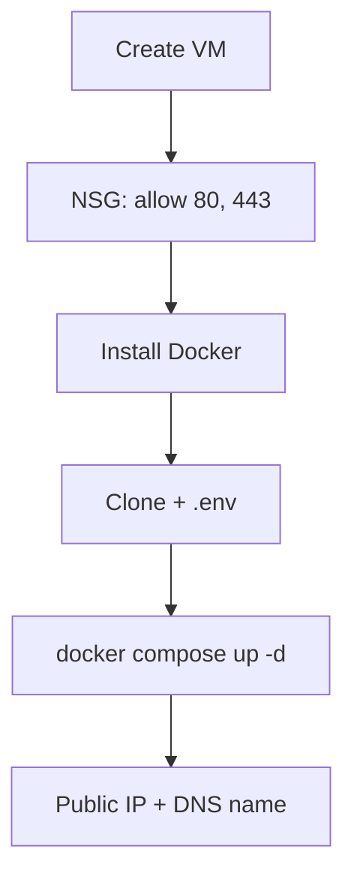

# Azure VM Deployment

Deploy DivineKart on an Azure Virtual Machine with Docker Compose.

## Level 2 — Azure-specific flow



## Step 1 — Create the VM

1. **Virtual machines → Create → Azure virtual machine**.
2. **Resource group**: new or existing.
3. **Region**: `Central India` or your nearest.
4. **Image**: Ubuntu 24.04 LTS.
5. **Size**: `Standard_B2s` (2 vCPU / 4 GiB) minimum.
6. **Authentication**: SSH public key (recommended).
7. **Public inbound ports**: SSH (22), HTTP (80), HTTPS (443).

## Step 2 — Install Docker & deploy

```bash
ssh azureuser@<public-ip>
sudo apt update && sudo apt upgrade -y
curl -fsSL https://get.docker.com | sudo sh
sudo usermod -aG docker $USER

git clone https://github.com/CodeRender7/spiritualEcom.git
cd spiritualEcom
cp .env.example .env && nano .env
docker compose up --build -d
docker compose ps
```

## Step 3 — DNS

1. In the VM **Overview**, note the **Public IP address** (you can make it static via *Configuration → Public IP → Assignment: Static*).
2. In your DNS provider, create an **A record** → public IP.
3. Follow the [reverse proxy & TLS guide](../infra/reverse-proxy-tls.md).

## Verification checklist

- [ ] `https://your-domain.com` serves the storefront
- [ ] Admin dashboard reachable at `/app`
- [ ] NSG restricted to needed ports only

## Cost estimate

| Size | ~$/mo |
|------|-------|
| Standard_B2s | ~$25–30 |
| New-account $200 credit | first month effectively free |