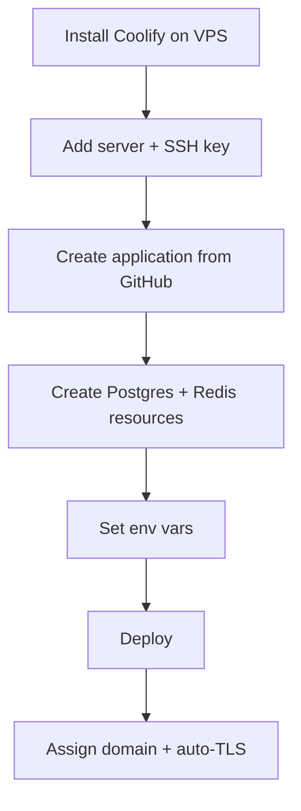

# Coolify Deployment (Self-Hosted PaaS)

Deploy DivineKart on [Coolify](https://coolify.io) — an open-source, self-hosted PaaS that gives you Railway-style convenience on your own VPS.

## Level 2 — Coolify-specific flow



## Step 1 — Install Coolify

On a fresh VPS (Ubuntu 24.04, 2 GB+ RAM):

```bash
curl -fsSL https://get.docker.com | sudo sh
curl -sSL https://get.coollabs.io/coolify | sudo bash
```

Open `https://<vps-ip>:8000`, create the admin account, and add the server via the UI (Coolify manages Docker for you).

## Step 2 — Add the GitHub application

1. **Create New Application** → **Public Repository** (or Private with GitHub App for auto-deploys).
2. Repo: `CodeRender7/spiritualEcom`.
3. **Build pack**: `Dockerfile` — point to the existing Dockerfiles:
   - Backend: `backend/Dockerfile`, context `/backend`
   - Storefront: `storefront/Dockerfile`, context `/storefront`

> **Note:** the repo Dockerfiles copy files from the repo root — set the build context accordingly (or add a `coolify.json`/build-time vars as needed).

## Step 3 — Database & cache resources

**Create New Resource → Database → PostgreSQL** and **→ Redis** in the Coolify UI. Copy the generated connection strings into the backend app's env vars.

## Step 4 — Env vars

- Backend: `DATABASE_URL`, `REDIS_URL`, `JWT_SECRET`, `COOKIE_SECRET`, CORS vars, admin credentials.
- Storefront: `NEXT_PUBLIC_MEDUSA_BACKEND_URL` (backend's public URL), `MEDUSA_BACKEND_URL` (backend's private URL if same server), publishable key, store name.

## Step 5 — Deploy & domain

Click **Deploy**. Then **Domains** → add `your-domain.com` → Coolify auto-provisions Let's Encrypt TLS via Traefik.

## Notes & gotchas

- Coolify's Docker-based deploys map 1:1 to this repo's compose setup — lowest-friction self-hosting option.
- Enable **Auto-deploy** on the GitHub App for push-to-deploy.
- Backups: Coolify supports scheduled DB backups to S3.

## Cost estimate

| Resource | ~$/mo |
|----------|-------|
| Coolify (open source) | $0 |
| VPS (4 GB / 2 vCPU) | $12–24 |