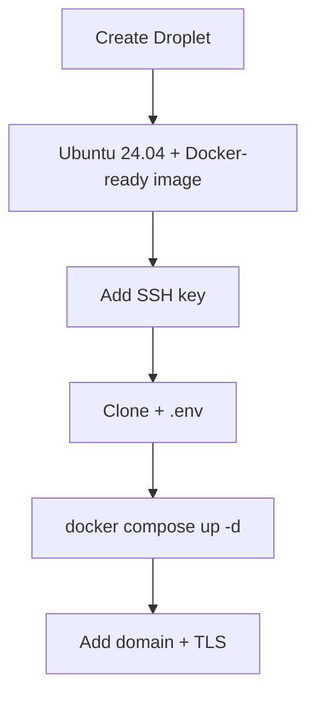

# DigitalOcean Droplet Deployment

Deploy DivineKart on a DigitalOcean Droplet — the most common choice for small production stores.

## Level 2 — DO-specific flow



## Step 1 — Create a Droplet

1. **Create → Droplets** in the DO console.
2. **Region**: `BLR1` (Bangalore) for India, or nearest to your customers.
3. **Image**: Ubuntu 24.04 LTS.
4. **Size**: **Basic, Regular, 2 GB / 1 vCPU** ($12/mo) is the realistic floor for the full compose stack; **4 GB / 2 vCPU** ($24/mo) recommended for production.
5. **Authentication**: SSH key (add your public key).
6. **Backups**: enable (adds ~20% cost) for automatic nightly snapshots.

## Step 2 — One-line deploy

```bash
ssh root@<droplet-ip>
curl -fsSL https://get.docker.com | sudo sh

git clone https://github.com/CodeRender7/spiritualEcom.git
cd spiritualEcom
cp .env.example .env && nano .env
docker compose up --build -d
docker compose ps
```

## Step 3 — Domain & TLS

1. **Networking → Domains** → add your domain → create an **A record** pointing at the droplet IP.
2. Follow the [reverse proxy & TLS guide](../infra/reverse-proxy-tls.md).

## Verification checklist

- [ ] Storefront live at `https://your-domain.com`
- [ ] Admin at `/app`
- [ ] Droplet backups enabled
- [ ] Monitor via [OpenObserve](../infra/monitoring.md)

## Cost estimate

| Size | ~$/mo |
|------|-------|
| 2 GB / 1 vCPU | $12 |
| 4 GB / 2 vCPU | $24 |
| Managed Postgres (optional) | from $15 |

**Why DO first?** Predictable pricing, $200/60-day new-account credit, excellent docs, and the Docker-ready Ubuntu image removes a setup step.