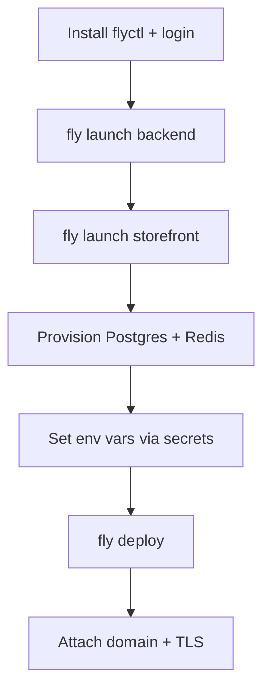

# Fly.io Deployment (PaaS)

Deploy DivineKart on Fly.io — global edge deployment with per-region scaling and built-in TLS.

## Level 2 — Fly.io-specific flow



## Step 1 — Install & login

```bash
curl -L https://fly.io/install.sh | sh
fly auth login
```

## Step 2 — Launch the backend

```bash
cd spiritualEcom/backend
fly launch --name divinekart-backend --no-deploy
```

Edit `fly.toml`:

```toml
[build]
  builder = "heroku/buildpacks:20"

[env]
  PORT = "9000"
  MEDUSA_ADMIN_EMAIL = "admin@divinekart.com"
  # ... other non-secret vars

[services]
  internal_port = 9000
  protocol = "tcp"
  [[services.ports]]
    handlers = ["http"]
    port = 80
  [[services.tcp_checks]]
    interval = "30s"
    timeout = "5s"
    grace_period = "30s"
    port = 9000
    path = "/health"
```

## Step 3 — Launch the storefront

```bash
cd spiritualEcom/storefront
fly launch --name divinekart-storefront --no-deploy
```

Set `internal_port = 8000` in its `fly.toml`, and env:

- `NEXT_PUBLIC_MEDUSA_BACKEND_URL` → `https://divinekart-backend.fly.dev`
- `MEDUSA_BACKEND_URL` → `http://divinekart-backend.internal:9000` (private network)

## Step 4 — Postgres & Redis

```bash
fly postgres create --name divinekart-db --region <your-region>
fly postgres attach --app divinekart-backend divinekart-db
# DATABASE_URL is injected automatically

# Redis via Upstash or fly.io's marketplace add-on
```

## Step 5 — Secrets & deploy

```bash
fly secrets set JWT_SECRET=... COOKIE_SECRET=... MEDUSA_ADMIN_PASSWORD=... --app divinekart-backend
fly deploy --app divinekart-backend
fly deploy --app divinekart-storefront
```

## Step 6 — Custom domain & TLS

```bash
fly certs add your-domain.com --app divinekart-storefront
```

Add the required DNS records shown by `fly certs show`, then Fly.io issues Let's Encrypt TLS automatically.

## Notes & gotchas

- Fly volumes are ephemeral per-machine — use the managed Postgres for durable data.
- Multiple machines scale horizontally; the Postgres connection pool handles the load.
- Wire `REDIS_URL` (Upstash or Fly add-on) before enabling queues/jobs.

## Cost estimate

| Resource | ~$/mo |
|----------|-------|
| Shared-cpu-1x (256 MB) | ~$3 each app |
| Managed Postgres (dev) | ~$7–15 |
| Egress | usage-based |