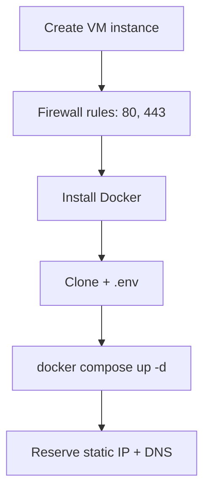

# GCP Compute Engine Deployment

Deploy DivineKart on Google Cloud Compute Engine with Docker Compose.

## Level 2 — GCP-specific flow



## Step 1 — Create a VM

1. **Compute Engine → VM instances → Create instance**.
2. **Name**: `divinekart-prod`.
3. **Region**: choose one near your customers (e.g. `asia-south1` for India).
4. **Machine type**: `e2-medium` (2 vCPU / 4 GiB) minimum; `e2-standard-2` for production.
5. **Boot disk**: Ubuntu 24.04 LTS, 30 GB+.
6. **Firewall**: check **Allow HTTP traffic** and **Allow HTTPS traffic**.

## Step 2 — Firewall (if HTTP/HTTPS not checked)

```bash
gcloud compute firewall-rules create allow-http \
  --allow tcp:80 --source-ranges 0.0.0.0/0
gcloud compute firewall-rules create allow-https \
  --allow tcp:443 --source-ranges 0.0.0.0/0
```

## Step 3 — Install Docker & deploy

```bash
sudo apt update && sudo apt upgrade -y
curl -fsSL https://get.docker.com | sudo sh
sudo usermod -aG docker $USER

git clone https://github.com/CodeRender7/spiritualEcom.git
cd spiritualEcom
cp .env.example .env && nano .env
docker compose up --build -d
docker compose ps
```

## Step 4 — Static IP + DNS

1. **VPC network → External IP addresses → Reserve static address** → attach to the VM.
2. Point your domain's **A record** at the static IP.
3. Follow the [reverse proxy & TLS guide](../infra/reverse-proxy-tls.md).

## Verification checklist

- [ ] `https://your-domain.com` serves the storefront
- [ ] Admin dashboard reachable at `/app`
- [ ] Backups configured per [backups guide](../infra/backups.md)

## Cost estimate

| Resource | ~$/mo |
|----------|-------|
| e2-medium | ~$25 + egress |
| e2-standard-2 | ~$49 |
| Free tier (e2-micro, 750h/mo) | $0 for light use |