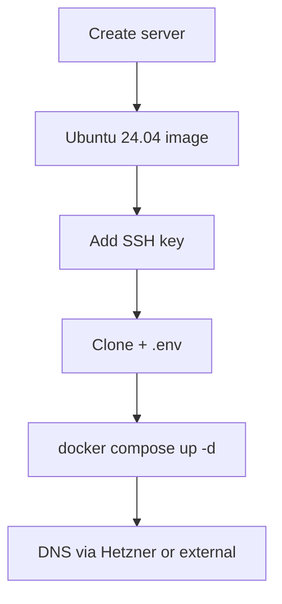

# Hetzner Cloud Deployment

Deploy DivineKart on Hetzner Cloud — the best price/performance ratio in the EU.

## Level 2 — Hetzner-specific flow



## Step 1 — Create a server

1. **Cloud → Servers → Create Server** in the Hetzner console.
2. **Location**: `FSN1` (Falkenstein) or `NUE1` (Nuremberg) for EU; `ASH` (US East) for North America.
3. **Image**: Ubuntu 24.04 LTS.
4. **Type**: `CX32` (4 vCPU / 8 GiB, ~€9/mo) recommended — comfortable headroom for the stack.
5. **SSH key**: add your public key.
6. **Volumes & backups**: enable **Backups** (~20% of plan cost).

## Step 2 — Deploy

```bash
ssh root@<server-ip>
curl -fsSL https://get.docker.com | sudo sh

git clone https://github.com/CodeRender7/spiritualEcom.git
cd spiritualEcom
cp .env.example .env && nano .env
docker compose up --build -d
docker compose ps
```

## Step 3 — DNS & TLS

1. In the console: **DNS → Add Zone** for your domain → **A record** → server IP.
2. Follow the [reverse proxy & TLS guide](../infra/reverse-proxy-tls.md).

## Verification checklist

- [ ] Storefront live at `https://your-domain.com`
- [ ] Admin at `/app`
- [ ] Backups enabled
- [ ] Monitor via [OpenObserve](../infra/monitoring.md)

## Cost estimate

| Type | ~€/mo |
|------|-------|
| CX22 (2 vCPU / 4 GiB) | ~€4 |
| CX32 (4 vCPU / 8 GiB) | ~€9 |
| Backups (+20%) | ~€1–2 |

> **Tip:** Hetzner is ~3–5× cheaper than AWS/Azure equivalents at similar specs — ideal for a cost-conscious production store.