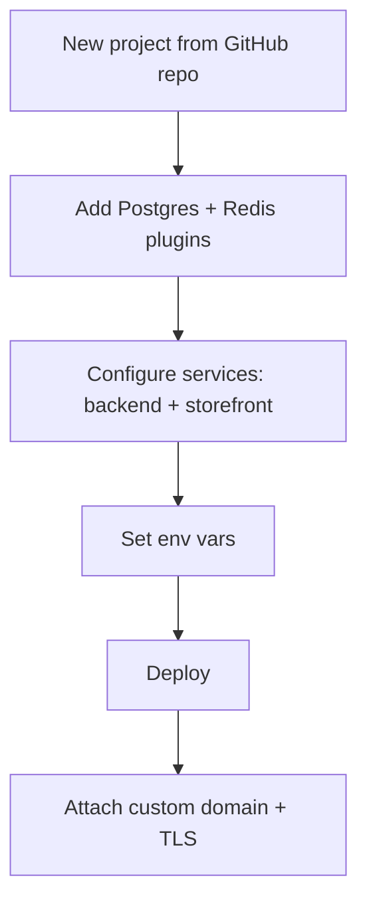

# Railway Deployment (PaaS)

Deploy DivineKart on Railway — zero-ops deploys from GitHub with automatic builds, TLS, and private networking.

## Level 2 — Railway-specific flow

## Step 1 — Create the project

1. Sign in at [railway.app](https://railway.app) → **New Project → Deploy from GitHub repo** → select `CodeRender7/spiritualEcom`.
2. Railway builds from the root; configure two services:

## Step 2 — Backend service (Medusa)

| Setting | Value |
|---------|-------|
| Build command | `pnpm --filter divinekart-backend build` |
| Start command | `pnpm --filter divinekart-backend start` |
| Root directory | `/` |

Environment variables:

- `DATABASE_URL`, `REDIS_URL` — from plugins below
- `JWT_SECRET`, `COOKIE_SECRET` — generate strong values
- `MEDUSA_ADMIN_EMAIL` / `MEDUSA_ADMIN_PASSWORD`
- `STORE_CORS` / `ADMIN_CORS` / `AUTH_CORS`

## Step 3 — Storefront service (Next.js)

| Setting | Value |
|---------|-------|
| Build command | `pnpm --filter divinekart-storefront build` |
| Start command | `pnpm --filter divinekart-storefront start` |
| Root directory | `/` |

Environment variables:

- `NEXT_PUBLIC_MEDUSA_BACKEND_URL` — backend's Railway public URL (`https://backend-production-xxxx.up.railway.app`)
- `MEDUSA_BACKEND_URL` — backend's **private** URL (`http://backend.railway.internal:9000`)
- `NEXT_PUBLIC_MEDUSA_PUBLISHABLE_KEY`, `NEXT_PUBLIC_STORE_NAME`

## Step 4 — Add plugins

**New → Database → PostgreSQL** and **New → Database → Redis** — Railway provisions them and injects connection strings into the backend service automatically.

## Step 5 — Domains & TLS

1. Click the storefront service → **Settings → Networking → Generate Domain** (free `*.up.railway.app`).
2. For a custom domain: **Networking → Custom Domain** → add `your-domain.com` → set the CNAME as shown → Railway auto-provisions TLS.

## Notes & gotchas

- Storefront must use **SSR** (default here) — not `output: 'export'` — because it fetches from the backend at request time.
- Backend public URL is needed only for browser calls; use the private `*.railway.internal` URL for server-to-server.
- Cron jobs (nightly builds, backups) are not natively supported — schedule them externally.

## Cost estimate

| Resource | ~$/mo |
|----------|-------|
| Shared CPU (backed by usage) | ~$5–15 |
| Postgres (1 GB) | ~$7 |
| Redis (256 MB) | ~$7 |