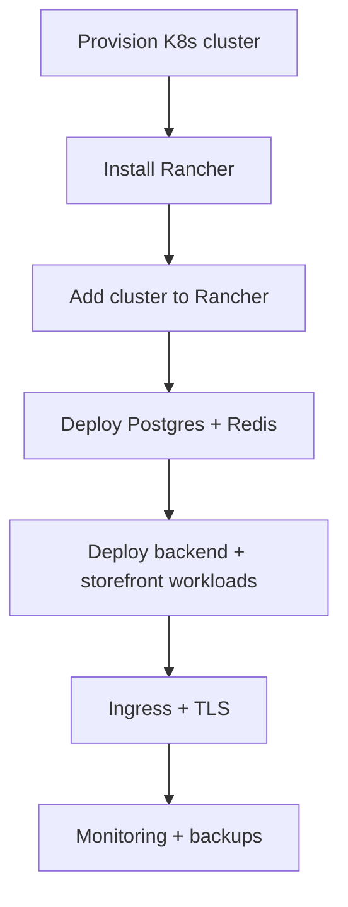

# Rancher Deployment (Kubernetes)

Deploy DivineKart on a Kubernetes cluster managed with Rancher. Choose this when you need autoscaling, rolling deploys, and multi-node resilience beyond single-host Docker Compose.

## Level 2 — Rancher-specific flow



## Step 1 — Provision a cluster

Any CNCF-compliant cluster works: **RKE2** (Rancher's own distro, recommended), **k3s** (single-node, lightest), **EKS/GKE/AKS**, or kubeadm.

Minimal k3s single-node:

```bash
curl -sfL https://get.k3s.io | sh -
export KUBECONFIG=/etc/rancher/k3s/k3s.yaml
```

## Step 2 — Install Rancher

```bash
helm repo add rancher-latest https://releases.rancher.com/server-charts/latest
kubectl create namespace cattle-system
helm install rancher rancher-latest/rancher \
  --namespace cattle-system --set hostname=rancher.your-domain.com
```

Access `https://rancher.your-domain.com`, set the admin password, and add your cluster.

## Step 3 — Deploy stateful services

Use Helm charts (Bitnami) for the backing stores:

```bash
helm install postgres oci://registry-1.docker.io/bitnamicharts/postgresql \
  --set auth.postgresPassword=... --set persistence.size=20Gi
helm install redis oci://registry-1.docker.io/bitnamicharts/redis \
  --set auth.password=... --set architecture=standalone
```

## Step 4 — Deploy the apps

Create `deploy.yaml` per service (backend + storefront), referencing the GHCR images:

```yaml
apiVersion: apps/v1
kind: Deployment
metadata:
  name: backend
spec:
  replicas: 2
  selector:
    matchLabels: { app: backend }
  template:
    metadata:
      labels: { app: backend }
    spec:
      containers:
        - name: backend
          image: ghcr.io/coderender7/spiritualecom-backend:latest
          ports: [{ containerPort: 9000 }]
          envFrom:
            - secretRef: { name: backend-env }
---
apiVersion: v1
kind: Service
metadata: { name: backend }
spec:
  selector: { app: backend }
  ports: [{ port: 9000, targetPort: 9000 }]
```

Apply, then repeat for `storefront` (image `.../spiritualecom-storefront`, port 8000).

## Step 5 — Ingress + TLS

```yaml
apiVersion: networking.k8s.io/v1
kind: Ingress
metadata:
  name: divinekart
  annotations:
    cert-manager.io/cluster-issuer: letsencrypt-prod
spec:
  rules:
    - host: your-domain.com
      http:
        paths:
          - path: /app
            pathType: Prefix
            backend: { service: { name: backend, port: { number: 9000 } } }
          - path: /
            pathType: Prefix
            backend: { service: { name: storefront, port: { number: 8000 } } }
```

Install cert-manager + a Let's Encrypt ClusterIssuer to auto-issue TLS.

## Notes & gotchas

- **Overkill for most stores** — choose this only when you need autoscaling/multi-node HA.
- Storefront SSR + 2 replicas → ensure the Medusa backend URL points to the backend **Service** (DNS), not a pod.
- Persistence: use PVCs/volumes for Postgres/Redis/MinIO or managed equivalents.
- The nightly GHCR images from `docker-nightly.yml` are ideal for continuous K8s rollouts.

## Cost estimate

| Resource | ~$/mo |
|----------|-------|
| k3s single node (2 vCPU / 4 GB) | ~$10–24 |
| RKE2 3-node (managed) | 3× instance cost |
| Rancher (open source) | $0 (support is paid) |