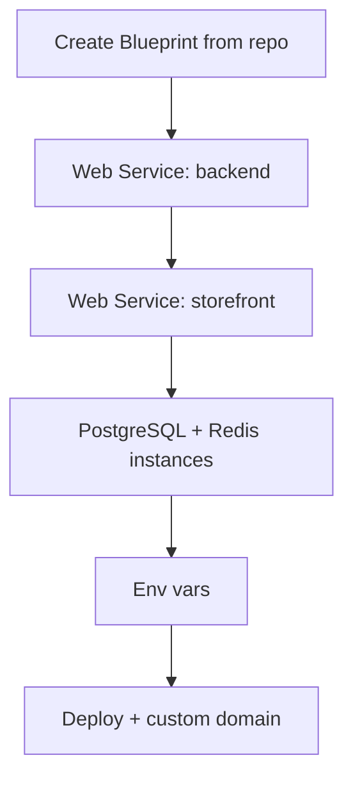

# Render Deployment (PaaS)

Deploy DivineKart on Render using Blueprints — declare infrastructure-as-code and let Render handle builds, TLS, and private networking.

## Level 2 — Render-specific flow



## Step 1 — Create a Blueprint

1. [render.com](https://render.com) → **New → Blueprint** → connect `CodeRender7/spiritualEcom`.
2. Define `render.yaml` in the repo root (see template below), or configure services manually.

## `render.yaml` template

```yaml
services:
  - type: web
    name: backend
    runtime: node
    rootDir: .
    buildCommand: pnpm install && pnpm --filter divinekart-backend build
    startCommand: pnpm --filter divinekart-backend start
    healthCheckPath: /health
    envVars:
      - key: DATABASE_URL
        fromDatabase:
          name: divinekart-db
          property: connectionString
      - key: JWT_SECRET
        generateValue: true
      - key: COOKIE_SECRET
        generateValue: true
      - key: STORE_CORS
        value: https://*.onrender.com
      - key: ADMIN_CORS
        value: https://*.onrender.com
      - key: AUTH_CORS
        value: https://*.onrender.com

  - type: web
    name: storefront
    runtime: node
    rootDir: .
    buildCommand: pnpm install && pnpm --filter divinekart-storefront build
    startCommand: pnpm --filter divinekart-storefront start
    envVars:
      - key: NEXT_PUBLIC_MEDUSA_BACKEND_URL
        fromService:
          name: backend
          type: web
          property: url
      - key: NEXT_PUBLIC_MEDUSA_PUBLISHABLE_KEY
        sync: false
      - key: NEXT_PUBLIC_STORE_NAME
        value: DivineKart

databases:
  - name: divinekart-db
    databaseName: divinekart
    user: divinekart
    plan: basic
```

## Step 2 — Redis

Add a **Redis** instance (Render → New → Redis) and set `REDIS_URL` on the backend service.

## Step 3 — Custom domain & TLS

1. Storefront service → **Settings → Custom Domains** → add `your-domain.com`.
2. Add the CNAME record at your DNS provider → Render auto-issues Let's Encrypt TLS.

## Notes & gotchas

- Use `fromService` for the storefront→backend URL so Render injects the real URL automatically.
- Free-tier web services sleep after 15 min idle — use a paid instance for production.
- `healthCheckPath: /health` enables zero-downtime deploys.

## Cost estimate

| Resource | ~$/mo |
|----------|-------|
| Web service (Starter) | $7 each |
| PostgreSQL (Basic, 1 GB) | $19 |
| Redis (Basic, 256 MB) | $15 |