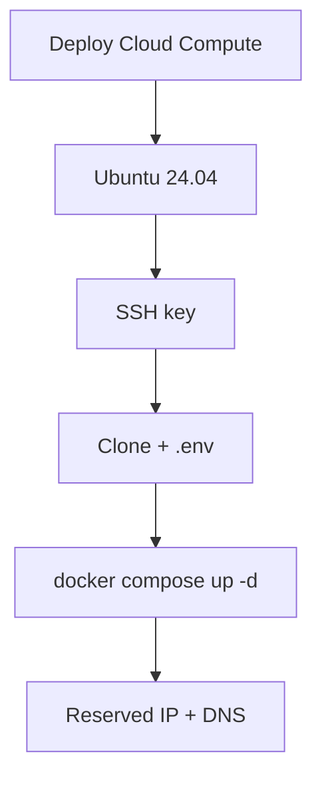

# Vultr Deployment

Deploy DivineKart on a Vultr Cloud Compute instance.

## Level 2 — Vultr-specific flow



## Step 1 — Deploy an instance

1. **Products → Cloud Compute → Deploy New Server**.
2. **Location**: `Singapore` or nearest to your customers.
3. **Image**: Ubuntu 24.04 LTS.
4. **Plan**: **Regular Performance, 2 GB / 1 vCPU** ($6/mo) floor; **4 GB / 2 vCPU** ($12/mo) recommended.
5. **SSH key**: add your public key.

## Step 2 — Deploy

```bash
ssh root@<instance-ip>
curl -fsSL https://get.docker.com | sudo sh

git clone https://github.com/CodeRender7/spiritualEcom.git
cd spiritualEcom
cp .env.example .env && nano .env
docker compose up --build -d
docker compose ps
```

## Step 3 — Reserved IP & DNS

1. **Network → Reserved IP → Add** → attach to the instance (keeps the IP stable across re-deploys).
2. Point your domain's **A record** at the reserved IP.
3. Follow the [reverse proxy & TLS guide](../infra/reverse-proxy-tls.md).

## Verification checklist

- [ ] Storefront live at `https://your-domain.com`
- [ ] Admin at `/app`
- [ ] Reserved IP in place (survives reboots/redeploys)

## Cost estimate

| Plan | ~$/mo |
|------|-------|
| 2 GB / 1 vCPU | $6 |
| 4 GB / 2 vCPU | $12 |
| Reserved IP | $2 (free while attached) |