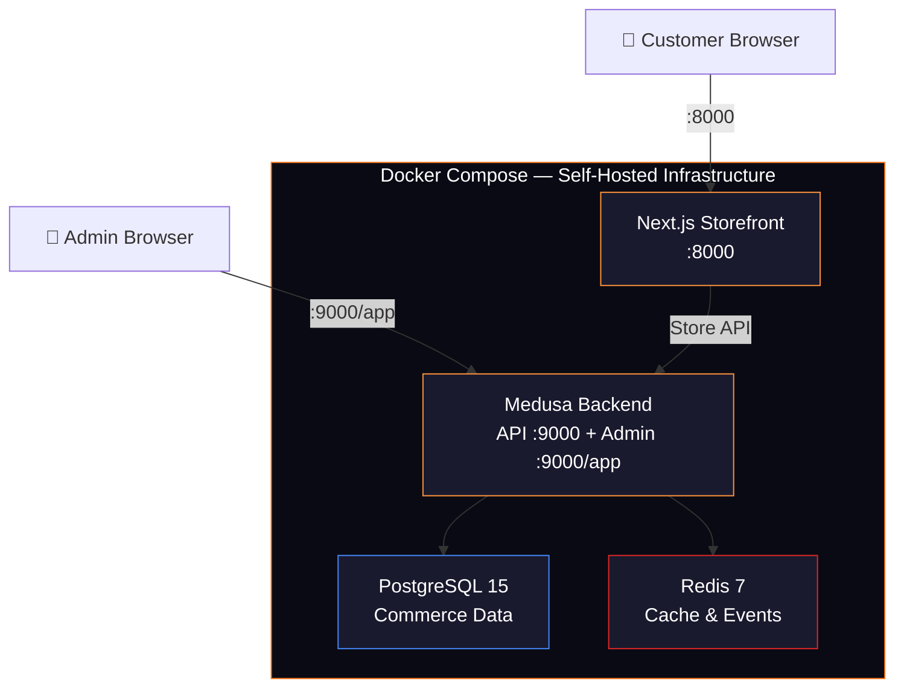

# 🕉️ DivineKart — Hindu Religious & Spiritual Ecommerce Store

Full-stack self-hosted ecommerce platform for Hindu religious and spiritual products, built on Medusa v2 with Docker infrastructure and a premium Next.js storefront.

## Architecture Overview



| Service | Image / Build | Port | Purpose |
|---------|---------------|------|---------|
| **PostgreSQL** | `postgres:15-alpine` | 5432 (internal) | Commerce data storage |
| **Redis** | `redis:7-alpine` | 6379 (internal) | Caching, events, workflow engine |
| **Medusa Backend** | Custom (`./backend/Dockerfile`) | **9000** | REST API + Admin Dashboard |
| **Next.js Storefront** | Custom (`./storefront/Dockerfile`) | **8000** | Customer-facing store |

---

## Product Categories (Medusa Collections)

| # | Collection | Example Products |
|---|-----------|-----------------|
| 1 | **Religious Photos** | Framed deity photos, laminated prints, wall art |
| 2 | **God Image Keyrings** | Metal/acrylic keychains with deity images |
| 3 | **Spiritual Idols** | Brass, marble, resin murtis & statues |
| 4 | **Spiritual Stickers** | Vinyl/holographic deity stickers, car stickers |
| 5 | **Banners & Posters** | Festival banners, large format deity posters |
| 6 | **Photo Frames** | Wooden/metal frames with deity images |
| 7 | **Handbills** | Puja invitation cards, event pamphlets |
| 8 | **Spiritual Stationery** | Notebooks, calendars, bookmarks with mantras |
| 9 | **Spiritual Flags** | Dhwaja, prayer flags, temple flags |
| 10 | **Spiritual Clothing** | Kurtas, dhotis, prayer shawls, scarves |

---

## UI/UX Design System

### Design References

| Inspiration | What We Adopt |
|-------------|---------------|
| **[xalen.io](https://xalen.io)** | Hero section structure: badge → serif headline → sub-headline → dual CTA → stats row. Dark sections with glassmorphism cards. Section headers with label + heading + description pattern. Feature grid with numbered cards. |
| **Flipkart** | Horizontal scroll product carousels per category. Multi-column mega-menu navigation. Product card grid (4-col desktop, 2-col mobile). Deal/offer banners. Star ratings & price display. |
| **Amazon India** | Category pill navigation. Product listing with filters sidebar. "Frequently bought together" sections. Breadcrumb navigation. Customer review snippets. |

### Color Palette — Saffron & Spiritual Theme

```
Primary:        #F97316 (Saffron Orange)
Primary Light:  #FB923C (Light Saffron)
Primary Glow:   #FDBA74 (Warm Gold)
Accent:         #DC2626 (Sindoor Red)
Accent Alt:     #7C3AED (Spiritual Purple)
Background:     #0F0F17 (Deep Dark)
Surface:        #1A1A2E (Card Dark)
Text Primary:   #FFFFFF
Text Secondary: rgba(255,255,255,0.6)
Border:         rgba(249,115,22,0.15)
Success:        #10B981 (Emerald)
```

### Typography

```
Headlines (Serif):   'Newsreader', Georgia, serif  — for spiritual gravitas
Body (Sans):         'Inter', system-ui, sans-serif — for readability
Mono:                'JetBrains Mono', monospace     — for prices/codes
Hindi/Devanagari:    'Noto Sans Devanagari', sans-serif — for Hindi text
```

---

## Storefront Page Structure

### 1. Homepage (`/`)
Adopting xalen.io section pattern + Flipkart carousel layout:

| Section | Design Pattern | Description |
|---------|---------------|-------------|
| **Navbar** | Flipkart-style mega-menu | Logo, category mega-menu, search bar, cart, account icons |
| **Announcement Bar** | xalen.io badge style | "🕉️ FREE SHIPPING on orders above ₹499 • Use code DIVINE10 for 10% off" |
| **Hero Section** | xalen.io hero | Badge → Serif headline ("Sacred Art & Spiritual Essentials for Every Devotee") → Description → Dual CTA (Shop Now / Browse Collections) → Stats row (1000+ Products • 50+ Categories • Pan-India Delivery) |
| **Category Carousel** | Flipkart circular icons | Horizontal scroll of circular category icons (like Flipkart homepage) |
| **Deal of the Day** | Flipkart deal strip | Countdown timer + horizontal scroll product cards with discount badges |
| **Featured Collections** | xalen.io feature grid | 3-column bento grid of top collections with large images |
| **Trending Products** | Amazon/Flipkart carousel | Horizontal scroll product cards with ratings, price, add-to-cart |
| **New Arrivals** | Flipkart carousel | Latest products carousel |
| **Why Shop With Us** | xalen.io "Why" section | 4 numbered feature cards (Authentic Products, Pan-India Shipping, Secure Payment, Easy Returns) |
| **Testimonials** | xalen.io testimonials | 3-column customer review cards |
| **Newsletter CTA** | xalen.io CTA section | Dark section with gradient headline, email input |
| **Footer** | Amazon-style multi-column | Categories, customer service, about, social links, payment icons |

### 2. Products Listing (`/products`, `/collections/[handle]`)
Flipkart/Amazon product listing layout:

| Element | Design |
|---------|--------|
| **Breadcrumbs** | Home → Collections → [Category Name] |
| **Sidebar Filters** | Price range, Rating, Availability, Sort by |
| **Product Grid** | 4-col desktop, 3-col tablet, 2-col mobile |
| **Product Card** | Image (hover zoom), title, price (₹ with MRP strike), star rating, quick add-to-cart, wishlist icon |
| **Pagination** | Load more / infinite scroll |

### 3. Product Detail (`/products/[handle]`)
Amazon-style product detail:

| Element | Design |
|---------|--------|
| **Image Gallery** | Main image + thumbnails, zoom on hover |
| **Product Info** | Title, price, variant selector, quantity, Add to Cart, Buy Now |
| **Description Tabs** | Description, Specifications, Reviews |
| **Related Products** | "You might also like" carousel |

### 4. Cart (`/cart`)
| Element | Design |
|---------|--------|
| **Cart Items** | Image, name, variant, quantity adjuster, price, remove |
| **Summary** | Subtotal, shipping estimate, total, Checkout CTA |

---

## User Review Required

> [!IMPORTANT]
> **Docker Desktop Required**: You must have Docker Desktop (or Docker Engine + Compose v2) installed and running on your Windows machine before executing.

> [!IMPORTANT]
> **First build will be slow**: Initial `docker compose up --build` downloads base images and installs npm dependencies (~5-10 min). Subsequent runs use Docker cache.

> [!NOTE]
> **Default Admin**: `admin@divinekart.com` / `supersecret` — change after first login.

> [!NOTE]
> **Store Name**: "DivineKart" — a Hindu religious & spiritual ecommerce store. Let me know if you want a different name.

---

## Open Questions

> [!IMPORTANT]
> **Product Images**: Since this is a demo/dev setup, I will generate placeholder product images using AI image generation for a few seed products. Real product photos should be uploaded via the Medusa Admin Dashboard later.

> [!NOTE]
> **Payment Gateway**: The initial setup uses Medusa's manual payment provider. Razorpay/Stripe integration can be added as a follow-up.

> [!NOTE]
> **Language**: The storefront will be primarily in English with Hindi text accents (mantras, section headers). Full Hindi localization can be added later.

---

## Proposed Changes

All files in `c:\Users\raj90\OneDrive\Desktop\WorkSpace\project`.

---

### Root — Docker Configuration

#### [NEW] [docker-compose.yml](file:///c:/Users/raj90/OneDrive/Desktop/WorkSpace/project/docker-compose.yml)
4-service Docker Compose:
- **postgres**: PostgreSQL 15 Alpine, healthcheck, persistent volume
- **redis**: Redis 7 Alpine, healthcheck, persistent volume
- **backend**: Medusa v2 from `./backend/Dockerfile`, env vars for DB/Redis/JWT, port 9000
- **storefront**: Next.js from `./storefront/Dockerfile`, env vars for Medusa URL, port 8000

#### [NEW] [.env](file:///c:/Users/raj90/OneDrive/Desktop/WorkSpace/project/.env)
Root env file: DB credentials, JWT/cookie secrets, Redis URL, CORS origins.

#### [NEW] [.gitignore](file:///c:/Users/raj90/OneDrive/Desktop/WorkSpace/project/.gitignore)
Git ignore for node_modules, .env, Docker volumes, build artifacts.

#### [NEW] [README.md](file:///c:/Users/raj90/OneDrive/Desktop/WorkSpace/project/README.md)
Comprehensive docs: quick start, architecture, env vars, common commands.

---

### Backend — Medusa v2 Application (`./backend/`)

#### [NEW] [backend/Dockerfile](file:///c:/Users/raj90/OneDrive/Desktop/WorkSpace/project/backend/Dockerfile)
Multi-stage: deps → build → runtime with `medusa start`.

#### [NEW] [backend/package.json](file:///c:/Users/raj90/OneDrive/Desktop/WorkSpace/project/backend/package.json)
Medusa v2 deps: `@medusajs/medusa`, `@medusajs/admin-bundler`, `@medusajs/framework`.

#### [NEW] [backend/medusa-config.ts](file:///c:/Users/raj90/OneDrive/Desktop/WorkSpace/project/backend/medusa-config.ts)
Config: PostgreSQL, Redis, Admin dashboard, Store CORS, JWT/cookie secrets.

#### [NEW] [backend/tsconfig.json](file:///c:/Users/raj90/OneDrive/Desktop/WorkSpace/project/backend/tsconfig.json)
TypeScript config for Medusa backend.

#### [NEW] [backend/.env](file:///c:/Users/raj90/OneDrive/Desktop/WorkSpace/project/backend/.env)
Backend env (overridden by docker-compose).

#### [NEW] [backend/scripts/entrypoint.sh](file:///c:/Users/raj90/OneDrive/Desktop/WorkSpace/project/backend/scripts/entrypoint.sh)
Docker entrypoint: wait for Postgres → run migrations → seed on first run → start server.

#### [NEW] [backend/scripts/seed-data.ts](file:///c:/Users/raj90/OneDrive/Desktop/WorkSpace/project/backend/scripts/seed-data.ts)
Seed script creating:
- **Store**: DivineKart store configuration
- **Region**: India (INR currency)
- **Shipping**: Standard & Express shipping options
- **10 Collections**: One per product category
- **30+ Products**: 3+ per category with variants, prices in INR
- **Admin User**: admin@divinekart.com

#### [NEW] [backend/src/admin/.gitkeep](file:///c:/Users/raj90/OneDrive/Desktop/WorkSpace/project/backend/src/admin/.gitkeep)
#### [NEW] [backend/src/api/.gitkeep](file:///c:/Users/raj90/OneDrive/Desktop/WorkSpace/project/backend/src/api/.gitkeep)

---

### Storefront — Next.js Application (`./storefront/`)

#### [NEW] [storefront/Dockerfile](file:///c:/Users/raj90/OneDrive/Desktop/WorkSpace/project/storefront/Dockerfile)
Multi-stage: deps → build → production runtime.

#### [NEW] [storefront/package.json](file:///c:/Users/raj90/OneDrive/Desktop/WorkSpace/project/storefront/package.json)
Next.js 14+ with TypeScript, Medusa JS SDK.

#### [NEW] [storefront/next.config.mjs](file:///c:/Users/raj90/OneDrive/Desktop/WorkSpace/project/storefront/next.config.mjs)
Next.js config with image domains for Medusa.

#### [NEW] [storefront/tsconfig.json](file:///c:/Users/raj90/OneDrive/Desktop/WorkSpace/project/storefront/tsconfig.json)
TypeScript config with path aliases (`@/` → `src/`).

---

#### Styles & Layout

#### [NEW] [storefront/src/app/globals.css](file:///c:/Users/raj90/OneDrive/Desktop/WorkSpace/project/storefront/src/app/globals.css)
Complete design system CSS:
- CSS custom properties (saffron palette, typography, spacing)
- Dark theme base styles
- Glassmorphism utilities
- Gradient animations (hero shimmer, card hover glow)
- Horizontal scroll carousel styles
- Product card hover effects with scale + shadow
- Mega-menu dropdown styles
- Responsive breakpoints (mobile-first)
- Star rating component styles
- Price display with MRP strikethrough

#### [NEW] [storefront/src/app/layout.tsx](file:///c:/Users/raj90/OneDrive/Desktop/WorkSpace/project/storefront/src/app/layout.tsx)
Root layout: Inter + Newsreader + Noto Sans Devanagari fonts, meta tags, SEO, dark theme body.

---

#### Shared Library

#### [NEW] [storefront/src/lib/medusa.ts](file:///c:/Users/raj90/OneDrive/Desktop/WorkSpace/project/storefront/src/lib/medusa.ts)
Medusa Store API client:
- `getProducts()` — fetch products with pagination
- `getProduct(handle)` — fetch single product by handle
- `getCollections()` — fetch all collections
- `getCollection(handle)` — fetch collection + products
- `searchProducts(query)` — search products
- Type definitions for Product, Collection, Price, Variant

#### [NEW] [storefront/src/lib/utils.ts](file:///c:/Users/raj90/OneDrive/Desktop/WorkSpace/project/storefront/src/lib/utils.ts)
Utility functions:
- `formatPrice(amount, currency)` — format ₹1,299.00
- `getDiscountPercentage(sale, mrp)` — calculate % off
- `truncateText(text, length)` — truncate descriptions
- `cn(...classes)` — conditional classNames

---

#### Components (Premium Design)

#### [NEW] [storefront/src/components/Navbar.tsx](file:///c:/Users/raj90/OneDrive/Desktop/WorkSpace/project/storefront/src/components/Navbar.tsx)
**Flipkart-style mega navigation:**
- Top bar: Logo (🕉️ DivineKart) + Search bar + Account + Cart with count
- Category mega-menu: hover dropdown with 3-column grid of categories + featured images
- Mobile: hamburger → slide-out drawer
- Glassmorphism backdrop-blur on scroll

#### [NEW] [storefront/src/components/AnnouncementBar.tsx](file:///c:/Users/raj90/OneDrive/Desktop/WorkSpace/project/storefront/src/components/AnnouncementBar.tsx)
Saffron gradient announcement strip with marquee text.

#### [NEW] [storefront/src/components/HeroSection.tsx](file:///c:/Users/raj90/OneDrive/Desktop/WorkSpace/project/storefront/src/components/HeroSection.tsx)
**xalen.io-inspired hero:**
- Badge: "LAUNCH OFFER: Free shipping on first order"
- Serif headline: "Sacred Art & Spiritual Essentials"
- Italic accent: "for Every Devotee"
- Description paragraph
- Dual CTA: Primary (Shop Now →) + Outline (Browse Collections)
- Stats row: 1000+ Products | 50+ Categories | Pan-India Delivery | Secure Payments
- Right side: decorative spiritual art/pattern (CSS gradient art or generated image)
- Fade-in animations on scroll

#### [NEW] [storefront/src/components/CategoryCarousel.tsx](file:///c:/Users/raj90/OneDrive/Desktop/WorkSpace/project/storefront/src/components/CategoryCarousel.tsx)
**Flipkart-style circular category icons:**
- Horizontal scroll row
- Circular image + category name below
- Hover: scale up + saffron border glow
- Auto-scroll on desktop

#### [NEW] [storefront/src/components/ProductCard.tsx](file:///c:/Users/raj90/OneDrive/Desktop/WorkSpace/project/storefront/src/components/ProductCard.tsx)
**Premium product card (Flipkart/Amazon hybrid):**
- Image with hover zoom effect
- Wishlist heart icon (top-right)
- Discount badge (e.g., "20% OFF") in saffron
- Product title (2-line clamp)
- Star rating (★★★★☆) with count
- Price: ₹sale price + ~~₹MRP~~ + discount %
- Quick "Add to Cart" button on hover
- Card hover: translateY(-4px) + shadow glow

#### [NEW] [storefront/src/components/ProductCarousel.tsx](file:///c:/Users/raj90/OneDrive/Desktop/WorkSpace/project/storefront/src/components/ProductCarousel.tsx)
**Horizontal scroll product strip:**
- Section header with label + heading (xalen.io pattern)
- Left/right arrow navigation
- Horizontal scroll container with snap points
- "View All →" link
- Used for: Trending, New Arrivals, Featured, Deals

#### [NEW] [storefront/src/components/DealBanner.tsx](file:///c:/Users/raj90/OneDrive/Desktop/WorkSpace/project/storefront/src/components/DealBanner.tsx)
**Deal of the Day section:**
- Countdown timer (HH:MM:SS)
- Dark background with saffron accents
- Product cards in horizontal scroll with special deal pricing

#### [NEW] [storefront/src/components/FeaturedCollections.tsx](file:///c:/Users/raj90/OneDrive/Desktop/WorkSpace/project/storefront/src/components/FeaturedCollections.tsx)
**xalen.io bento grid:**
- 3-column asymmetric grid (1 large + 2 small or 2+1)
- Large collection images with overlay text
- Hover: image scale + gradient overlay brightens
- Collection name + product count

#### [NEW] [storefront/src/components/WhyShopWithUs.tsx](file:///c:/Users/raj90/OneDrive/Desktop/WorkSpace/project/storefront/src/components/WhyShopWithUs.tsx)
**xalen.io "Why" section with 4 numbered cards:**
- 01: Authentic & Blessed Products
- 02: Pan-India Fast Delivery
- 03: Secure & Easy Payments
- 04: Hassle-Free Returns
- Each card: number + icon + heading + description
- Dark section with saffron accents

#### [NEW] [storefront/src/components/Testimonials.tsx](file:///c:/Users/raj90/OneDrive/Desktop/WorkSpace/project/storefront/src/components/Testimonials.tsx)
**xalen.io testimonial cards:**
- 3-column grid
- Star rating + review text + customer name + avatar
- Card border with subtle saffron glow

#### [NEW] [storefront/src/components/NewsletterCTA.tsx](file:///c:/Users/raj90/OneDrive/Desktop/WorkSpace/project/storefront/src/components/NewsletterCTA.tsx)
**Dark CTA section:**
- Serif headline: "Stay Connected with the Divine"
- Email input + Subscribe button
- Background: gradient mesh

#### [NEW] [storefront/src/components/Footer.tsx](file:///c:/Users/raj90/OneDrive/Desktop/WorkSpace/project/storefront/src/components/Footer.tsx)
**Amazon-style multi-column footer:**
- 4 columns: Shop by Category, Customer Service, About DivineKart, Connect
- Payment method icons (UPI, Visa, Mastercard, RuPay)
- Copyright + legal links
- "Back to top" button

#### [NEW] [storefront/src/components/StarRating.tsx](file:///c:/Users/raj90/OneDrive/Desktop/WorkSpace/project/storefront/src/components/StarRating.tsx)
Reusable star rating display component (1-5 stars with half-star support).

#### [NEW] [storefront/src/components/PriceDisplay.tsx](file:///c:/Users/raj90/OneDrive/Desktop/WorkSpace/project/storefront/src/components/PriceDisplay.tsx)
Reusable price display: ₹sale + ~~₹MRP~~ + discount badge.

#### [NEW] [storefront/src/components/SearchBar.tsx](file:///c:/Users/raj90/OneDrive/Desktop/WorkSpace/project/storefront/src/components/SearchBar.tsx)
Search with autocomplete dropdown, recent searches, trending suggestions.

#### [NEW] [storefront/src/components/BreadcrumbNav.tsx](file:///c:/Users/raj90/OneDrive/Desktop/WorkSpace/project/storefront/src/components/BreadcrumbNav.tsx)
Breadcrumb navigation component.

---

#### Pages

#### [NEW] [storefront/src/app/page.tsx](file:///c:/Users/raj90/OneDrive/Desktop/WorkSpace/project/storefront/src/app/page.tsx)
**Homepage** assembling all sections:
AnnouncementBar → Navbar → Hero → CategoryCarousel → DealBanner → FeaturedCollections → ProductCarousel(Trending) → ProductCarousel(New Arrivals) → WhyShopWithUs → Testimonials → NewsletterCTA → Footer

#### [NEW] [storefront/src/app/products/page.tsx](file:///c:/Users/raj90/OneDrive/Desktop/WorkSpace/project/storefront/src/app/products/page.tsx)
**All Products page:**
- Breadcrumbs
- Sidebar filters (price, rating, collection)
- Product grid (4-col → 2-col mobile)
- Sort dropdown (Price low-high, Rating, Newest)
- Result count
- Pagination / Load more

#### [NEW] [storefront/src/app/products/[handle]/page.tsx](file:///c:/Users/raj90/OneDrive/Desktop/WorkSpace/project/storefront/src/app/products/[handle]/page.tsx)
**Product Detail page:**
- Image gallery with thumbnails
- Product info panel (title, price, variants, quantity, Add to Cart)
- Tabbed content (Description, Specifications, Reviews)
- Related products carousel

#### [NEW] [storefront/src/app/collections/page.tsx](file:///c:/Users/raj90/OneDrive/Desktop/WorkSpace/project/storefront/src/app/collections/page.tsx)
**Collections listing page:**
- Grid of collection cards with images and names

#### [NEW] [storefront/src/app/collections/[handle]/page.tsx](file:///c:/Users/raj90/OneDrive/Desktop/WorkSpace/project/storefront/src/app/collections/[handle]/page.tsx)
**Collection detail page:**
- Collection header with title & description
- Product grid filtered by collection
- Sidebar filters

#### [NEW] [storefront/src/app/cart/page.tsx](file:///c:/Users/raj90/OneDrive/Desktop/WorkSpace/project/storefront/src/app/cart/page.tsx)
**Cart page:**
- Cart item list with image, name, variant, quantity, price
- Summary sidebar: Subtotal, shipping, total, Checkout button
- Empty cart state with "Continue Shopping" CTA

---

## Verification Plan

### Automated Tests
```bash
# Build and start all 4 services
docker compose up --build -d

# Verify all containers are running
docker compose ps

# Test backend health
curl http://localhost:9000/health

# Test store API — list products
curl http://localhost:9000/store/products

# Test store API — list collections
curl http://localhost:9000/store/collections

# Test storefront renders
curl -s http://localhost:8000 | head -50

# Seed data (if not auto-seeded)
docker compose exec backend npx medusa db:seed
```

### Manual Verification
1. **Admin Dashboard**: `http://localhost:9000/app` → login → verify 10 collections and 30+ products created
2. **Storefront Homepage**: `http://localhost:8000` → verify hero section, category carousel, product grids
3. **Product Listing**: `/products` → verify grid layout, filters, sort
4. **Product Detail**: Click any product → verify image gallery, price, variants
5. **Collections**: `/collections` → verify all 10 categories show up
6. **Cart**: Add items → verify cart page works
7. **Mobile**: Resize browser → verify responsive layout
8. **Mega-menu**: Hover categories → verify dropdown renders
