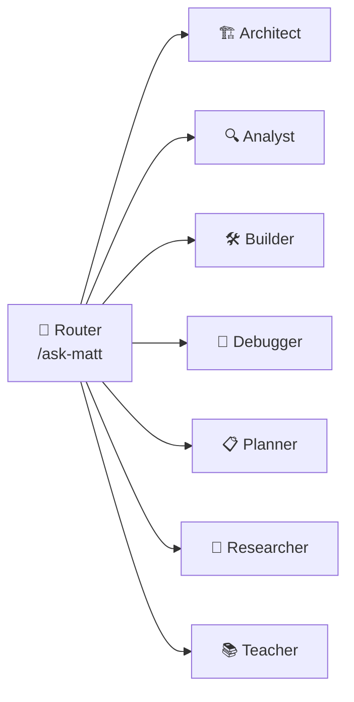

# Walkthrough — MCP + Skills + Swarm Orchestration Setup

## Summary

Installed 4 MCP servers, added 18 new mattpocock/skills (total 27), and configured enterprise swarm-based agent orchestration across Antigravity IDE and OpenCode with 7 agent personas and 3 execution patterns.

---

## Phase 1: MCP Server Installations

### ✅ codebase-memory-mcp v0.9.0
- **Binary**: `C:/Users/raj90/.local/bin/codebase-memory-mcp.exe`
- **Installed via**: Official `install.ps1` PowerShell installer
- **Auto-configured**: Gemini CLI, OpenCode, VS Code, Cursor, Kiro
- **Purpose**: Persistent codebase understanding — `search_graph`, `trace_path`, `get_code_snippet`

### ✅ fallow v3.10.0
- **Installed via**: `pnpm add -Dw fallow` (project devDependency)
- **Binary**: `pnpm exec fallow-mcp` (Rust-native, signed & verified)
- **Purpose**: Static analysis — dead code, duplication, complexity, circular deps, boundaries

### ✅ gitnexus v1.6.9
- **Installed via**: `pnpm add -g gitnexus` (global)
- **Binary**: `C:/Users/raj90/AppData/Local/pnpm/bin/gitnexus.CMD`
- **Purpose**: Git history intelligence — change frequency, co-change, impact analysis

### ✅ graphify (graphifyy v0.9.32 + graphify-mcp)
- **Installed via**: `uv tool install graphifyy` (30 packages including tree-sitter parsers)
- **Binary**: `C:/Users/raj90/.local/bin/graphify-mcp.exe`
- **Purpose**: Knowledge graph — dependency visualization, module coupling, import chains

---

## Phase 2: IDE MCP Configuration

Both IDEs now share identical MCP server configs with all 4 servers.

### Antigravity IDE
- **Config**: [mcp_config.json](file:///C:/Users/raj90/.gemini/config/mcp_config.json)
- **Format**: `mcpServers` object with command + args

### OpenCode
- **Config**: [opencode.json](file:///C:/Users/raj90/.config/opencode/opencode.json)
- **Format**: `mcp` object with type/command/enabled

---

## Phase 3: Skills Inventory (27 Total)

### Engineering Skills (mattpocock/skills) — 21 skills
| Skill | Type | Purpose |
|-------|------|---------|
| ask-matt | User-invoked | Router — picks the right skill for your situation |
| code-review | Model-invoked | Two-axis review: Standards + Spec, parallel sub-agents |
| codebase-design | Model-invoked | Deep module design discipline |
| design-an-interface | User-invoked | Interface design and iteration |
| diagnosing-bugs | Model-invoked | Reproduce → minimise → hypothesise → instrument → fix → regression-test |
| domain-modeling | Model-invoked | Build and sharpen domain models against glossary |
| grill-with-docs | User-invoked | Grilling + domain model building with CONTEXT.md updates |
| implement | User-invoked | Build work from spec/tickets, /tdd at seams, /code-review |
| improve-codebase-architecture | User-invoked | Architecture scan → visual HTML report → grill |
| prototype | Model-invoked | Throwaway prototypes for design questions |
| qa | User-invoked | Quality assurance verification |
| research | Model-invoked | Investigate against primary sources, cited Markdown |
| resolving-merge-conflicts | Model-invoked | Resolve conflicts hunk by hunk, by intent |
| setup-matt-pocock-skills | User-invoked | One-time repo configuration |
| tdd | Model-invoked | Red-green-refactor loop, one vertical slice |
| to-spec | User-invoked | Synthesize conversation into spec |
| to-tickets | User-invoked | Break plans into tracer-bullet tickets |
| triage | User-invoked | Move issues through triage state machine |
| ubiquitous-language | User-invoked | Enforce consistent domain vocabulary |
| wayfinder | User-invoked | Plan huge multi-session work as investigation ticket maps |
| writing-great-skills | User-invoked | Reference for writing effective skills |

### Productivity Skills (mattpocock/skills) — 4 skills
| Skill | Type | Purpose |
|-------|------|---------|
| grill-me | User-invoked | Relentless interview until all decisions resolved |
| grilling | Model-invoked | Reusable interview loop (behind grill-me + grill-with-docs) |
| handoff | User-invoked | Compact conversation into handoff document |
| teach | User-invoked | Multi-session teaching with stateful workspace |

### Custom MCP-Powered Skills (local) — 2 skills
| Skill | Purpose |
|-------|---------|
| codebase-analysis | Composite analysis using all 4 MCP servers |
| code-health | Pollution & complexity tracking via fallow |

---

## Phase 4: Agent Skills Sync

- Fixed `agent/skills/` broken YAML frontmatter by re-syncing from canonical `.agents/skills/`
- All 27 skills now synced across: `.agents/skills/`, `.claude/skills/`, `.opencode/skills/`, `skills/`, `agent/skills/`

---

## Phase 5: Swarm Orchestration

### Files Created
- [swarm-config.md](file:///c:/Users/raj90/OneDrive/Desktop/WorkSpace/project/.agents/swarm/swarm-config.md) — Full persona definitions + execution patterns + MCP integration map
- [SKILL.md (swarm)](file:///c:/Users/raj90/OneDrive/Desktop/WorkSpace/project/.agents/swarm/SKILL.md) — Meta-skill for pattern selection
- [codebase-analysis](file:///c:/Users/raj90/OneDrive/Desktop/WorkSpace/project/.agents/skills/codebase-analysis/SKILL.md) — Composite MCP analysis skill
- [code-health](file:///c:/Users/raj90/OneDrive/Desktop/WorkSpace/project/.agents/skills/code-health/SKILL.md) — Pollution/complexity monitoring

### 7 Agent Personas

| Persona | Primary Skills | MCP Tools |
|---------|---------------|-----------|
| 🏗️ Architect | improve-codebase-architecture, codebase-design, domain-modeling | graphify, fallow |
| 🔍 Analyst | codebase-analysis, code-review, code-health, qa | fallow, graphify, gitnexus, codebase-memory |
| 🛠️ Builder | implement, tdd, prototype, design-an-interface | codebase-memory, fallow |
| 🐛 Debugger | diagnosing-bugs, tdd, research | codebase-memory, gitnexus, fallow |
| 📋 Planner | wayfinder, to-spec, to-tickets, grill-me, triage | codebase-memory, gitnexus |
| 🔬 Researcher | research, grill-with-docs, domain-modeling | codebase-memory, graphify |
| 📚 Teacher | teach, writing-great-skills, handoff | codebase-memory |

### 3 Execution Patterns

| Pattern | Flow | Use Case |
|---------|------|----------|
| **Harness** | wayfinder → to-spec → to-tickets → implement → tdd → code-review → handoff | New features |
| **Loop** | diagnosing-bugs → tdd → code-review → repeat | Bug fixing |
| **Graph** | improve-codebase-architecture ∥ codebase-design ∥ fallow scan → grill-with-docs → domain-modeling | Architecture review |

### Files Modified
- [AGENTS.md](file:///c:/Users/raj90/OneDrive/Desktop/WorkSpace/project/AGENTS.md) — Added MCP servers, swarm rules, code discovery rules
- [CONTEXT.md](file:///c:/Users/raj90/OneDrive/Desktop/WorkSpace/project/CONTEXT.md) — Added MCP/swarm/persona terminology

---

## Phase 6: Verification Results

| Check | Result |
|-------|--------|
| codebase-memory-mcp | ✅ v0.9.0 |
| fallow | ✅ v3.10.0 (signed) |
| gitnexus | ✅ v1.6.9 |
| graphify-mcp | ✅ working (Python serve mode) |
| Skills installed | ✅ 27 skills across all agent dirs |
| `pnpm turbo typecheck` | ✅ 2/2 packages pass |

---

## Next Steps

To activate the full analysis pipeline on this project:

1. **Index with codebase-memory**: Use `codebase-memory-mcp` → `index_repository` in your next agent session
2. **Index with gitnexus**: Run `gitnexus analyze` from the project root
3. **Build graphify graph**: Run `graphify .` from the project root
4. **Run code health check**: Use `/code-health` or `/codebase-analysis` skill
5. **Plan next work**: Use `/wayfinder` for large scope planning
